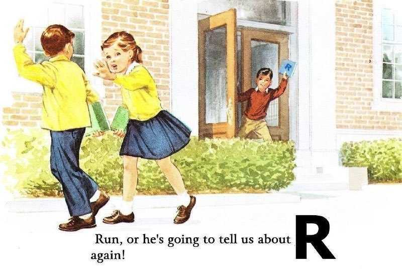
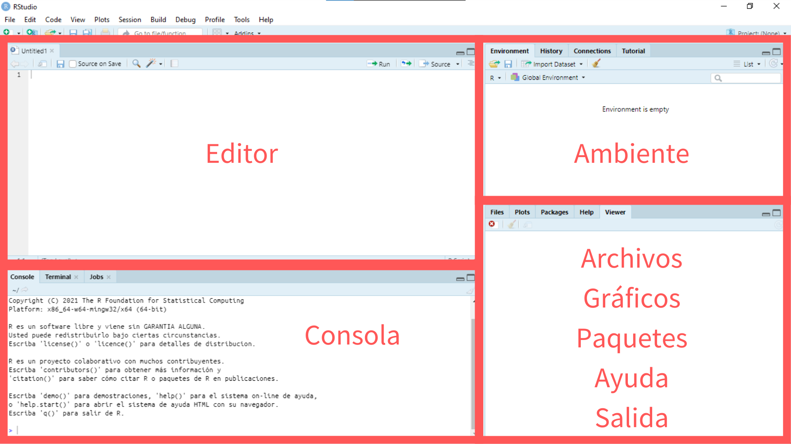
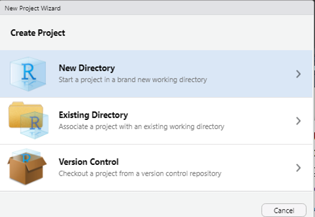
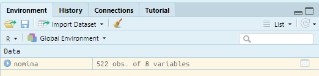

```{r setup, include=FALSE}
library(learnr)
knitr::opts_chunk$set(echo = FALSE)
```

## Curso Introducción a R para RRHH



Hola HR NeRd! Te doy la bienvenida al curso **Introducción a R para RRHH**. Este es un tutorial interactivo que te permitirá conocer algunos conceptos básicos de R, y sobre los tipos de datos.

Con este tutorial vas a familiarizarte con conceptos como:

-   **Objetos**

    -   Valores

    -   Vectores

    -   Data frames

-   **Tipos de variables**

Este tutorial fue creado para que te familiarices con la sintaxis de R y algunos de sus conceptos. Esto no quiere decir que estás por tu cuenta. Podés hacer consultas en nuestros canales de:

🤝 [Slack](https://join.slack.com/t/r4hr/shared_invite/zt-ocriyx5e-nqXuwWeDyOKm2ICUJjhu6g)

📡 [Discord](https://discord.gg/3xhNH6kRad)

En Slack tenemos un canal llamado #auxilio donde podés hacer todas las consultas que quieras.

Muchas gracias!

**Sergio Garcia Mora \|** **Data 4HR**

## Conceptos de R

En esta primera sección vamos a conocer algunos conceptos que son frecuentes de ver, leer y escuchar entre usuarios y usuarias de R.

Este [mapa conceptual](https://miro.com/app/board/o9J_l0IFd1Y=/) contiene algunos de los principales elementos para que te familiarices con esta sesión.

### RStudio

Para programar en R es recomendable contar con dos softwares:

-   [R](https://cran.r-project.org/): Es el motor que realiza la carga de datos y su análisis.
-   [RStudio](https://www.rstudio.com/products/rstudio/download/): Es una interfase que nos permite interactuar fácilmente con R, ver resultados y gestionar proyectos.

En el caso que tengas una computadora del trabajo que no tengas permiso para instalar programas, o que R funcione muy lento podés también usar la versión gratuita de [RStudio Cloud](https://rstudio.cloud/).

### Las ventanas de RStudio

A modo de introducción a RStudio, utilizaremos esta imagen publicada en el genial libro de Antonio Vazquez Brust, ["Ciencia de Datos para Gente Sociable"](https://bitsandbricks.github.io/ciencia_de_datos_gente_sociable/).

{width="568"}

Veamos cada panel.

-   **Editor**: El panel de edición es en donde recomendamos escribir nuestro código (también llamado *script*). Es un editor de texto que permite escribir las instrucciones, editarlas, copiar y pegar, etc.. La primera vez que abres RStudio tienes que crear un script usando las teclas *Ctrl + Shift + N*, o bien desde el menú *File -\> New File -\> R Script*.
-   **Consola**: Es donde corre el motor de R. Algunas salidas, mensajes de advertencia y errores, las veremos ahí.
-   **Ambiente** (arriba a la derecha): Cuando carguemos datos, almacenemos objetos con valores y resultados, veremos ahí su nombre. También podrás acceder a distintos tutoriales en la pestaña *Tutorial*.
-   **Archivos/Gráficos/Paquetes/Ayuda/Salida**: Cuando realicemos un gráfico, podremos verlo ahí en la pestaña *Plots*. La pestaña *Files* permite ver la carpeta del proyecto con los archivos y carpetas almacenados en esa carpeta. La pestaña *Packages* permite ver los paquetes instalados, e instalar y actualizar paquetes de forma sencilla. La pestaña *Help* nos permite navegar por la ayuda de los paquetes y funciones. *Viewer* es una pestaña donde podemos ver otro tipo de salidas de paquetes particulares.

### Proyectos

Los proyectos son una de las grandes ventajas de trabajar con RStudio. Internamente crea carpetas dentro de *Mis documentos* (o la carpeta que elijas) haciendo que tu código y los datos estén almacenados organizadamente, redireccionando las carpetas de trabajo cada vez que cambias de proyecto.

Para crear un proyecto primero hay que entrar en *File -\> New Project* y se abrirá una ventana como la siguiente:

{width="348"}

Elegimos la opción *New Directory* en la ventana siguiente volvemos a hacer click en *New Project* y luego en la siguiente ventana, podemos elegir el nombre del proyecto, elegir la carpeta en la que queremos guardarlo con el botón *Browse*.


Arriba a la derecha, debajo del ícono para cerrar el programa RStudio va a aparecer un ícono de un cubo celeste con el nombre del proyecto que acabamos de crear. Desde el menú desplegable podemos intercambiar de proyectos cada vez que lo necesitemos.

## Objetos

R es un lenguaje orientado a objetos. Esto quiere decir que a las tablas, valores y resultados, les podemos dar un nombre, y utilizar ese nombre para que sea más fácil operar y programar los scripts.

Los objetos son útiles porque nos permiten almacenar un resultado por ejemplo, y reutilizarlo despúes. Imaginá que todos los meses haces un informe. Podes programar que tu reporte hecho en R, guarde el resultado de la rotación del mes en un objeto, y utilizar el nombre del objeto en el informe. Cada mes ese valor se actualizará, pero vos hiciste el trabajo **una sola vez**.

> Recomendación: Poné nombres claros y descriptivos a los objetos, que sean breves, pero a su vez que den una pista sobre lo que contiene. Recordá que acá lo más importante no es que R entienda lo que estás haciendo, sino que lo pueda entender otra persona, e incluso vos mismo cuando vuelvas a leer tu propio script dentro de 6 meses o un año.

Algo interesante con los objetos es que podemos utilizarlos y operar con ellos en los scripts.

Para crear un objeto podemos usar el símbolo `<-` (la *"flechita"*), o bien el signo igual `=`. En R preferimos usar la *flechita* porque el signo igual se utiliza dentro de las funciones para modficicar parámetros.

### Ejercicio

Para crear un objeto hay que escribir el nombre del objeto, el símbolo de asignación `<-` (la *"flechita"*), y luego el valor. Para ejecutar la línea de código hay que apretar las teclas `Ctrl` + `Enter`.

Para ver el contenido del objeto solo hay que escribir su nombre y apretar `Ctrl` + `Enter` sobre la línea de código.

```{r obj-ej0, echo=TRUE}
# Creo un objeto numérico
valor <- 42

# Creo un objeto con un valor alfanumérico
nombre <- "Sergio"

# Ver los valores almacenados.
valor
nombre
```

En el siguiente ejemplo estoy creando un objeto con mi año de nacimiento. Luego lo puedo usar para calcular mi edad.

Para asignar un objeto, puedo apretar las teclas `Ctrl` + `Enter` sobre la línea de código, o bien el triángulo verde con forma de tecla *Play*.

Asigna al objeto `anio_nacimiento` tu año de nacimiento. Luego usa el objeto para calcular tu edad, y guardarlo en un objeto llamado `edad` .

```{r obj-ej1, echo=TRUE}
# Creo un objeto
anio.nacimiento <- 1979  # Apretar Ctrl + Enter

# Para ver el valor almacenado en el objeto
anio.nacimiento

# Puedo calcular mi edad usando el objeto almacenado.
2021 - anio.nacimiento

# Incluso puedo guardar el resultado en otro objeto
edad <- 2021 - anio.nacimiento

edad
```

**Ahora a practicar por tu cuenta**. Podés apretar la combinación `Ctrl` + `Enter` en cada líne de código y luego, o completar todos los pasos y hacer click en el botón `Run Code`.

Vas a crear un objeto indicando el año en que empezaste a trabajar o a estudiar en la Universidad. Luego, vas a calcular cuántos años de experiencia o estudio tenés.

Primero, crea un objeto y llamalo `inicio`. Asignale con la *flechita* el año en que empezaste a trabajar en tu actual empleo.

Luego, poné el año en el que empezaste a trabajar.

```{r objeto, exercise = TRUE, exercise.lines = 8}
inicio <- ____  # Completá el valor y apretá Ctrl + Enter
anio.actual <- 2021 # Crea el objeto apretando Ctrl + Enter

# Calculá tus años de experiencia
experiencia <- anio._____ - ________

experiencia
```

```{r objeto-hint-1}
# Poné el año en el que comenzaste en inicio
# Para calcular el objeto experiencia tenés que restar al año actual, tu año de inicio.
```

```{r objeto-hint-2}
inicio <- 2016  # Completá el valor y apretá Ctrl + Enter
anio.actual <- 2021 # Crea el objeto apretando Ctrl + Enter

# Calculá tus años de experiencia
experiencia <- anio.actual - inicio

experiencia
```

## Tipos de datos

Los tipos de datos con los que nos podemos encontrar son: \* **Numéricos**: los vamos a ver simbolizados con `num`, `int`, o `dbl`. \* **Texto**: los vamos a ver como `chr`. \* **Lógicos**: Asumen valores `TRUE` o `FALSE` y los veremos como `lgl`.

Prueba correr el siguiente código corriéndolo en `Run Code`.

```{r objeto2, exercise = TRUE, exercise.lines = 13}
# Valor numérico
respuesta <- 42

# Valor alfanumérico
nombre <- "Sergio"

# Valor lógico
spock <- TRUE

# Ver los resultados
respuesta
nombre
spock
```

Con la función `class()` podemos ver el tipo de valor que contiene. Completá con tus datos personales (no quedan almacenados en ningún lado, sólo en tu PC) y usá la función `class()` para ver el valor que contiene.

Recuerda usar las teclas `Ctrl` + `Enter` para guardar el valor en el objeto.

```{r objeto3, exercise = TRUE, exercise.lines = 13}
# Tu edad (real o la que sientes que tienes °v°)
edad <- _____

# Tu nombre, no olvides las comillas
nombre ___ ________

# ¿Estás graduado/a?
graduado __ _______

# Ahora usa la función class() para ver el tipo de valor almacenado.
class(edad)
class(____)
_____(____)
```

```{r objeto3-hint-1}
# Reemplaza los espacios vacios con los valores correctos
# Presta atención a las minúsculas y mayúsculas
# No olvides usar el operador <- para asignar el valor al objeto
```

```{r objeto3-hint-2}
# Estos pueden ser posibles ejemplos
# Tu edad (real o la que sientes que tienes °v°)
edad <- 42

# Tu nombre, no olvides las comillas
nombre <- "Sergio"

# ¿Estás graduado/a?
graduado <- TRUE

# Ahora usa la función class() para ver el tipo de valor almacenado.
class(edad)
class(nombre)
class(graduado)
```

Ahora respondé la siguiente pregunta:

**¿Cuál será la clase de este objeto?**

```{r trivia, eval=FALSE, echo=TRUE}
valor <- "1234"
```

```{r trivia1}
quiz(
  question("¿Qué clase tendrá el objeto 'valor' creado anteriormente?",
           answer("Numérico", message = "Si bien son números, al tener comillas R lo interpreta como texto"),
           answer("Texto", correct = TRUE, message = "Muy bien! Al ponerle comillas a los números le indicamos a R que interprete el valor como si fuera texto"),
           answer("Lógico", message = "Los valores lógicos sólo pueden tener como valores posibles TRUE o FALSE"),
           submit_button = "Enviar respuesta",
           try_again_button = "Intenta de nuevo",
           allow_retry = TRUE
))
```

### Descanso

¿Qué tal el primer esfuerzo? Programar es un ejercicio de tolerancia a la frustración, pero te prometo que cada vez que las cosas salen como querés la sensación es muy poderosa.

Te propongo hacer una pausa con esta canción antes de pasar al siguiente tema.

<iframe width="560" height="315" src="https://www.youtube.com/embed/GPeiU6RqIjA" title="YouTube video player" frameborder="0" allow="accelerometer; autoplay; clipboard-write; encrypted-media; gyroscope; picture-in-picture" allowfullscreen>

</iframe>

## Operaciones con objetos

Cuando estamos haciendo análisis podemos almacenar los resultados en objetos y después usarlos en cuentas. Planificar el flujo de los datos y de los resultados es lo que nos permitirá reutilizar un script en tareas repetitivas.

Estos son los operadores matemáticos que podemos usar en R:

```{r operadores-mat, warning=FALSE, message=FALSE}
library(dplyr)
library(gt)
gt(
  data.frame(
    "Símbolo" = c("+", "-", "*", "/", "^"),
    "Operación" = c("Suma/Adición", "Resta/Sustracción", "Multiplicación", "División", "Potencia")
  )
) %>% 
  cols_align(
    align = "center",
    columns = everything()
  )
```

Probemos algo simple:

```{r mate1, echo=TRUE}
uno <- 1

dos <- 2

# El resultado no los sorprenderá =P
uno + dos
```

En Argentina, nuestros sueldos brutos tienen tres descuentos obligatorios:

-   Jubilación: 11% (0.11)
-   Obra Social: 3% (0.03)
-   Seguridad Social: 3% (0.03)

En R el separador decimal es el punto (`.`), no la coma (`,`). Se puede cambiar la configuración pero es mejor adaptarse.


Crea un objeto para cada ítem, y luego crea un objeto llamado `cargas.sociales` con el resultado de la suma de los tres conceptos. Recuerda asignar el valor a los objetos con las teclas `Ctrl` + `Enter`.

```{r mat2, exercise=TRUE}
# Crea un objeto para cada concepto
jubilacion <- ____
obra.social <- 0.03
seguridad.social ___ ______

# Crea un objeto con la suma de los tres conceptos
cargas.sociales <- ______ + _______ __ __________
```

```{r mat2-hint-1}
# Pone los valores numéricos
# Recuerda que el separador de decimales es el punto.
# Para sumar los tres conceptos poné su nombre sin comillas
```

```{r mat2-solution}
# Crea un objeto para cada concepto
jubilacion <- 0.11
obra.social <- 0.03
seguridad.social <- 0.03

# Crea un objeto con la suma de los tres conceptos
cargas.sociales <- jubilacion + obra.social + seguridad.social
```

```{r ccss}
# Crea un objeto para cada concepto
jubilacion <- 0.11
obra.social <- 0.03
seguridad.social <- 0.03

# Crea un objeto con la suma de los tres conceptos
cargas.sociales <- jubilacion + obra.social + seguridad.social
```

Para calcular el sueldo neto (lo que me queda "de bolsillo") tengo que restar las deducciones por cargas sociales. Conceptualmente sería algo así:

```{r eval=FALSE, echo=TRUE}
sueldo.bruto * (1 - cargas.sociales) = sueldo.neto
```

Imaginemos que tenemos un sueldo bruto de U$D 1.000 (mil dólares). Calculemos el `sueldo.neto`

```{r mat3, exercise = TRUE, exercise.setup="ccss"}
# Cargas sociales ya está almacenado
cargas.sociales

# Crea un objeto que se llame sueldo.bruto
______ ___ _________

# Calculá el sueldo neto 
sueldo.neto <- _____ * (__ - ________)
  
# Verifica el resultado
sueldo.neto
```

```{r mat3-hint-1}
# Crea un objeto que se llame sueldo.bruto y asignale el sueldo de 1000
# Para calcular el sueldo neto tenés que multiplicar el objeto sueldo.bruto por 1 menos las cargas sociales. Revisa el esquema de más arriba
```

```{r mat3-solution}
# Cargas sociales ya está almacenado
cargas.sociales

# Crea un objeto que se llame sueldo.bruto
sueldo.bruto <- 1000

# Calculá el sueldo neto 
sueldo.neto <- sueldo.bruto * (1 - cargas.sociales)
  
# Verifica el resultado
sueldo.neto
```

Podés verificar el resultado de la siguiente manera:

```{r mat4, exercise=TRUE}
# Cargar el sueldo bruto del ejercicio anterior
sueldo.bruto <- 1000

# Calcular cargas sociales
jubilacion <- sueldo.bruto * 0.11
obra.social <- sueldo.bruto * 0.03
seguridad.social <- sueldo.bruto * 0.03

deducciones <- jubilacion + obra.social + seguridad.social

deducciones # Ver el descuento total

# Calcular sueldo neto
sueldo.neto <- sueldo.bruto - deducciones

sueldo.neto

```

### Otra pausa

Muy bien! Esta sección fue breve, pero poderosa, así que te mereces esta canción:

<iframe width="560" height="315" src="https://www.youtube.com/embed/skdE0KAFCEA" title="YouTube video player" frameborder="0" allow="accelerometer; autoplay; clipboard-write; encrypted-media; gyroscope; picture-in-picture" allowfullscreen></iframe>

## Vectores

Los vectores son conjuntos de datos. Un uso muy importante que le damos por ejemplo es cuando lo usamos con la función `filter()` o cuando hacemos selecciones de varios elementos.

También nos sirve como una buena introducción a la selección y modificación de elementos (vamos a jugar un poco a la guerra naval).


Se suele decir que los vectores *tienen una sola dimensión* (cuando veamos *data frames* esta última frase va a más tener sentido). En ellos se pueden almacenar datos numéricos, o categóricos, en incluso una combinación de ambos.

Para crear un vector y guardarlo en un objeto, necesitamos la función `c()` que significa *"combine"*.

Si creas vectores que contengan variables de tipo texto, cada elemento del vector tiene que tener sí o sí las comillas en cada elemento.

### Ejercicio

Crea un objeto con los nombres artísticos (sin los apellidos) de los integrantes de [Soda Stereo](https://es.wikipedia.org/wiki/Soda_Stereo).

```{r soda-nombres, exercise = TRUE, exercise.lines = 5}
nombres <- c("____", "____", )

nombres
```

```{r soda-nombres-hint-1}
# Cada elemento de un vector tiene que estar separado por comas.
# Si es una variable categórica, tiene que tener comillas.
```

```{r soda-nombres-hint-2}
nombres <- c("Gustavo", "Charly", "Zeta")

nombres
```

Perfecto! **Gustavo Cerati** tocaba la guitarra y era el cantante, **Charly Alberti** era el baterista, y **Zeta Bosio** tocaba el bajo.

### Modificar elementos de un vector

Para modificar elementos de un vector hay que poner el número del elemento entre corchetes (`[]`) y asignarle el valor que querramos modificar. Para eso tenemos que poner el nombre del vector, y entre corchetes poner el número de la posición del elemento que queremos modificar `nombre_vector[x]` donde x es el número de la posición en el vector.

Cambia el nombre del artista que no pertenece a Soda Stereo.

```{r soda-nombres2, exercise = TRUE, exercise.lines = 7}
nombres <- c("Gustavo", "Moro", "Zeta")

nombres[__] <- "___"

nombres
```

```{r soda-nombres2-hint}
# Oscar Moro fue un baterista argentino tremendo, pero no tocaba en Soda Stereo.
# Para reemplazar Moro por Charly tenés que poner dentro del corchete el número del elemento que querés modificar.
# Dentro de las comillas poné Charly.
```

```{r soda-nombres2-solution}
nombres <- c("Gustavo", "Moro", "Zeta")

nombres[2] <- "Charly"

nombres
```

Te dejo un link a una de [mis canciones favoritas](https://youtu.be/9sQBgDLCdmw) de Soda Stereo 🎸


## Dataframes

Los dataframes son objetos que contienen **filas** y **columnas**, como si fuera una hoja de cálculo por ejemplo. Se dice que este tipo de objetos suele tener 2 dimensiones, una que corresponde a las filas, y otra que corresponde a las columnas.

Cuando cargamos en R un archivo de Excel o nos conectamos a una tabla de una base de datos por ejemplo, vamos a ver en la pestaña *Enviroment* de RStudio el nombre del dataframe dentro de la categoría *"Data".* También podremos ver la cantidad de *observaciones* (filas) que tiene ese dataframe, y la cantidad de *variables* (columnas).



Cuando nos conectamos a un archivo que contenga filas y columnas, ya se carga el objeto en la memoria de R como un dataframe. También podemos crear dataframes en base a vectores que contengan la misma cantidad de elementos.

### Crear un dataframe en base a vectores

Completá los vectores para luego crear un dataframe con la función `data.frame()` .

```{r df-soda, exercise = TRUE, exercise.lines = 12}
# Vectores con datos de los integrantes de Soda Stereo.
nombres <- c("_____", "Charly", "Zeta")
instrumentos <- c("Guitarra", "Batería", "____")
nacimiento <- c(1959, 1963, 1958)

# Creamos el dataframe usando los nombres de los vectores
soda.stereo <- data.frame(nombres, ______, _______)

soda.stereo

```

```{r df-soda-hint}
# Completá los datos que faltan en los espacíos vacíos de los vectores.
# Poné los nombres de los vectores adentro de la función data.frame
# Cuidado con mayúsculas y minúsculas, R es case sensitive
```

```{r df-soda-solution}
# Vectores con datos de los integrantes de Soda Stereo.
nombres <- c("Gustavo", "Charly", "Zeta")
instrumentos <- c("Guitarra", "Batería", "Bajo")
nacimiento <- c(1959, 1963, 1958)

# Creamos el dataframe usando los nombres de los vectores
soda.stereo <- data.frame(nombres, instrumentos, nacimiento)

soda.stereo
```

### Modificar elementos de un dataframe

Para modificar un elemento puntual de un dataframe tenemos que *jugar a la Batalla Naval.* La lógica para seleccionar elementos de un dataframe es la siguiente: `nombre_dataframe[fila, columna]`. Por ejemplo acá estamos seleccionando de la siguiente tabla el elemento de la fila 3, y de la columna 1 (el nombre del bajista de Soda Stereo).

```{r ejemplo}
# Vectores con datos de los integrantes de Soda Stereo.
nombres <- c("Gustavo", "Charly", "Zeta")
instrumentos <- c("Guitarra", "Batería", "Bajo")
nacimiento <- c(1959, 1963, 1958)

# Creamos el dataframe usando los nombres de los vectores
soda.stereo <- data.frame(nombres, instrumentos, nacimiento)

soda.stereo

# Seleccionar el elemento de la fila 3, y la columna 2
soda.stereo[3, 1]

```

En el siguiente ejercicio hay un error en la base de datos, y cargaron mal el instrumento que toca el bajista Zeta Bosio. Corre el código para ver dónde está el error, y luego modifica el elemento del dataframe para que contenga la información correcta.

Recordá que para modificar un elemento puntual de un dataframe la lógica es `nombre_dataframe[fila, columna].`

```{r ej2, echo = FALSE}
soda.stereo <- data.frame(
  nombres = c("Gustavo", "Charly", "Zeta"),
  instrumentos = c("Guitarra", "Batería", "Violín"),
  nacimiento = c(1959, 1963, 1958)
)

```

```{r df-soda2, exercise = TRUE, exercise.lines = 10, exercise.setup="ej2" }
# Corre el código
soda.stereo

# Modifica el elemento incorrecto: nombre_dataframe[fila, columna]


# Pon el nombre del dataframe para ver si los datos son correctos ahora.

```

```{r df-soda2-hint-1}
# Para modificar un elemento de un dataframe tienes que poner dentro de los corchetes primero el número de la fila, y luego el número de la columna.
# Luego, asigna el valor correcto en la columna de instrumentos.
# Para terminar el ejercicio poné el nombre del dataframe y analizar si los datos se modificaron correctamente
```

```{r df-soda2-hint-2}
# Para asignar un nuevo valor de un dataframe tienes que poner:
# nombre_dataframe[fila, columna] que quieras modificar
# Asignar con "la flechita" (<-) o el signo igual el instrumento correcto ("Bajo")
```

```{r df-soda2-solution}
# Modifica el elemento incorrecto: nombre_dataframe[fila, columna]
soda.stereo[3,2] <- "Bajo"

# Pon el nombre del dataframe para ver si los datos son correctos ahora.
soda.stereo
```

## Check out

Bueno, llegamos al final de este tutorial. Recordá sumarte a [Slack](https://join.slack.com/t/r4hr/shared_invite/zt-ocriyx5e-nqXuwWeDyOKm2ICUJjhu6g) y a [Discord](https://discord.gg/3xhNH6kRad) (Discord es opcional).

Si hay algo que no entiendas podés usar el canal **#auxilio** de Slack.

Por favor, contame qué te pareció este tutorial [en este formulario](https://forms.gle/shbaunKh1AtkKKeu7) a ver qué podemos mejorar.

Y para celebrar el final de esta primera sesión, terminamos con un tema ATR (A Todo Ritmo)

<iframe width="560" height="315" src="https://www.youtube.com/embed/uqqO9G7I47s" title="YouTube video player" frameborder="0" allow="accelerometer; autoplay; clipboard-write; encrypted-media; gyroscope; picture-in-picture" allowfullscreen></iframe>


