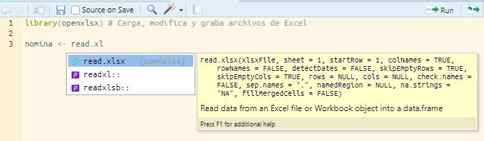
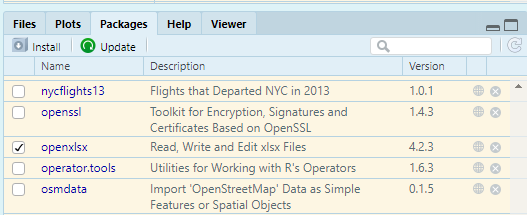
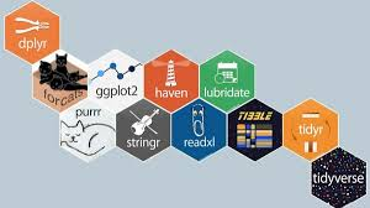

```{r setup, include=FALSE, message=FALSE, warning=FALSE}
library(learnr)
knitr::opts_chunk$set(echo = FALSE)

# Datasets
library(openxlsx)
library(tidyverse)

#carpeta <- "inst/tutorials/sesion1/"

plantel <- read.xlsx("plantel.xlsx")
salarios <- read.xlsx("puestos.xlsx")

empleados <- left_join(plantel, salarios, by = "ID")

mensualizados <- plantel %>% 
  left_join(salarios, by ="ID") %>% 
  filter(!is.na(PUESTO))
```

## Curso Introducción a R para RRHH

Este es un tutorial sobre la primera clase del curso **Introducción a R para RRHH** de [Data 4HR](https://data-4hr.com/capacitacion/curso-introduccion-r-para-rrhh/). El objetivo de este tutorial y sus preguntas es ayudar a comprender y fijar algunos conceptos de la clase 1.

Este tutorial no sería posible sin la comunidad latinoamericana de R, por eso este primer módulo lo pueden compartir y utilizar citando a Data 4HR, y sin fines comerciales.


Para contactarme, podés escribirme a [sergio\@d4hr.com](mailto:sergio@d4hr.com), visitar la web de [Data 4HR](https://data-4hr.com) o buscarme en redes sociales:

👨‍💼 [LinkedIn](https://www.linkedin.com/in/sergiogarciamora/)

⚔️ [Twitter](https://twitter.com/sergiogarciamor)

📱 [Telegram](http://t.me/SergioGarciaMora)

📡 [Discord](https://discord.gg/3xhNH6kRad)

🤝 [Slack](https://join.slack.com/t/r4hr/shared_invite/zt-ocriyx5e-nqXuwWeDyOKm2ICUJjhu6g)

Muchas gracias!

**Sergio Garcia Mora** **Data 4HR**


### Proyectos

Los proyectos son una de las grandes ventajas de trabajar con RStudio. Internamente crea carpetas dentro de *Mis documentos* (o la carpeta que elijas) haciendo que tu código y los datos estén almacenados organizadamente, redireccionando las carpetas de trabajo cada vez que cambias de proyecto.

Para crear un proyecto primero hay que entrar en *File -\> New Project* y se abrirá una ventana como la siguiente:

{width="348"}

Elegimos la opción *New Directory* en la ventana siguiente volvemos a hacer click en *New Project* y luego en la siguiente ventana, podemos elegir el nombre del proyecto, elegir la carpeta en la que queremos guardarlo con el botón *Browse*.


Arriba a la derecha, debajo del ícono para cerrar el programa RStudio va a aparecer un ícono de un cubo celeste con el nombre del proyecto que acabamos de crear. Desde el menú desplegable podemos intercambiar de proyectos cada vez que lo necesitemos.

## Repaso: Objetos

R es un lenguaje orientado a objetos. Esto quiere decir que las tablas, valores y resultados, les podemos dar un nombre, y utilizar ese nombre para que sea más fácil operar y programar los scripts.

> Recomendación: Poné nombres claros y descriptivos a los objetos, que sean breves, pero a su vez que den una pista sobre lo que contiene. Recordá que acá lo más importante no es que R entienda lo que estás haciendo, sino que lo pueda entender otra persona, e incluso vos mismo cuando vuelvas a leer tu propio script dentro de 6 meses o un año.

Algo interesante con los objetos es que podemos utilizarlos y operar con ellos en los scripts.

Para crear un objeto podemos usar el símbolo `<-` (la *"flechita"*), o bien el signo igual `=` .

### Ejercicio

Asigna al objeto `anio_nacimiento` tu año de nacimiento. Luego usa el objeto para calcular tu edad, y guardarlo en un objeto llamado `edad` .

```{r objeto, exercise = TRUE, exercise.lines = 8}
anio.nacimiento <- ____
anio.actual <- 2021

edad <- anio._____ - anio.________

edad
```

```{r objeto-hint-1}
# Poné el año en el que naciste en anio.nacimiento
# Para calcular el objeto edad tenés que restar al año actual, tu año de nacimiento
```

```{r objeto-hint-2}
anio.nacimiento <- 1979
anio.actual <- 2021

edad = anio.actual - anio.nacimiento

edad
```


## Paquetes

Los *paquetes* son conjuntos de funciones que desarrolla la comunidad de R y que amplían las capacidades y funcionalidades de R base. Nos permiten hacer más cosas y de manera más simple.

Los paquetes *se instalan por única vez* usando la función `install.packages("nombre_del_paquete")`. Dentro de la función, se tiene que poner el nombre del paquete, respetando mayúsculas y minúsculas, y **las comillas** son fundamentales.

Una vez que el paquete está instalado, tenemos que *"activarlo"* para poder usar sus funciones. Esto lo hacemos con la función `library(nombre_del_paquete)`. Si el paquete está instalado y estás usando RStudio, a medida que vayas escribiendo el nombre del paquete te va a aparecer el nombre para autocompletar.

Te das cuenta que el paquete está activo porque:

-   Al empezar a escribir las funciones, aparece para autocompletar el nombre de la función, a qué paquete pertenece, y un cuadro de ayuda.

    {width="550"}

-   En la pestaña **Packages** te va a aparecer con una tilde en el nombre del paquete. 

### Preguntas

En este primer ejercicio tendrás que corregir el código para activar el paquete `tidyverse`. ¿Cuál es la función que tenés que usar para lograrlo?

```{r activar-paquete, exercise = TRUE, exercise.lines = 4}
_______(tidyverse)
```

```{r activar-paquete-hint}
# Para instalar o activar un paquete revisa que el nombre no tenga errores de tipeo.
# R es case sensitive, controla que las mayúsculas o minúsculas estén bien.
# Recuerda que no son necesarias las comillas.
library(tidyverse)
```

```{r paquetes}
quiz(
  question("¿Cuántas veces hay que instalar un paquete?",
           answer("Una sola vez", correct = TRUE),
           answer("Cada vez que corremos un script", message = "La instalación sólo es necesaria una sola vez"),
           answer("Cada vez que creamos un proyecto nuevo", message = "No importa la cantidad de proyectos. Cada vez que instalamos un paquete queda disponible para todos los proyectos que creemos."),
           answer("Depende", message = "[Depende](https://youtu.be/dgf5QlcyTFY) es una bonita canción de Jarabe de Palo y en este caso es una respuesta incorrecta ;p"),
           submit_button = "Enviar respuesta",
           try_again_button = "Intenta de nuevo",
           allow_retry = TRUE),
  question("Cada vez que abro un script es necesario correr la función `library`",
           answer("Verdadero", correct = TRUE, message = "Si, es correcto, cada vez que abrimos R tenemos que correr el script desde el principio y vover a activar los paquetes."),
           answer("Falso", message = "Cada vez que abrimos el script hay que correr todo el código desde el principio y activar el paquete con la función library"),
           submit_button = "Enviar respuesta",
           try_again_button = "Intenta de nuevo",
           allow_retry = TRUE),
  question("¿Por qué aparece este mensaje de error?: 'no se pudo encontrar la función _________'",
  answer("Porque el paquete no está instalado", message = "Es posible, pero hay otra respuesta más específica"),
  answer("Porque no corrió la función library()", correct = TRUE, message = "Perfecto! La función library() activa las funciones"),
  answer("Porque está mal escrito el nombre del paquete", message = "Si hay un error de tipeo el mensaje diría: there is no package called ___"),
           submit_button = "Enviar respuesta",
           try_again_button = "Intenta de nuevo",
           allow_retry = TRUE
))
```

## Tidyverse

{width="438"}

Tidyverse es un conjunto de paquetes, diseñados principalmente para la manipulación y transformación de datos. En este primer curso trabajamos mucho con el paquete `dplyr` que nos permite filtrar datos, unir datos de diversas fuentes, y hacer las transformaciones necesarias para poder realizar nuestros análisis. Para saber más del resto de los paquetes buscá en el [Google Drive](https://drive.google.com/drive/folders/1Qck3z_t6XLRXb2vbN-00931DgdJZ0yse?usp=sharing) del **Club de R para RRHH** o mirá los videos en [Youtube](https://youtube.com/playlist?list=PLZuVytUJrxQlcqu6l-P3ou4vV2mRJU2Ka).

## Funciones o verbos de dplyr

Tené a mano el [cheatsheet de data-wrangling](https://drive.google.com/file/d/1ViFJRuby7FTDgjWvp9P6hKO3MEHgeH_M/view?usp=sharing) en castellano. Los cheatsheets (machetes, cola, trencito, torpedo, chuleta, copiatín, plage, chanchullo) son ayuda memorias con las principales funciones de un paquete.

Las funciones que vimos en el curso (que no son todas las del paquete) son:

-   **left_join():** Permite unir información de varias tablas. Los sistemas de gestión de RRHH tienen por ejemplo una tabla que tiene información básica de las personas (nombre y apellido, fecha de nacimiento, etc.), otra tabla con la remuneración base y los conceptos salariales que le correspondan, y podría tener otras tablas con las evaluaciones de desempeño y así sucesivamente. Hay muchos tipos distintos de `join`, pero a los fines prácticos de este curso nos quedaremos con `left_join()` que es una función equivalente a realizar un *buscarv* o un *vlookup* en Excel.

-   **select():** Permite seleccionar las columnas con las que queremos trabajar. También permite acomodarlas en el orden que las necesitemos, y también la podemos usar para descartar variables que no necesitemos.

-   **filter():** Nos permite filtrar las filas que cumplan con una o más condiciones. Por ejemplo, si queremos hacer un análisis de un grupo específico de empleados (por ejemplo Líderes), vamos a filtrar de una tabla de empleados, los empleados que tengan una posición de liderazgo.

-   **group_by():** Por ejemplo, si quiero analizar los sueldos promedios por puesto, un paso previo que tenemos que hacer es *agrupar* los datos por la variable `puesto` antes de calcular el promedio. Es un paso previo que realizaremos siempre antes de hacer algún cálculo de resumen estadístico.

-   **summarise():** Es la función que nos permite hacer cálculos de resumen estadístico (calcular promedios, medianas, contar filas, desvíos estándares, etc.). Lo

-   **mutate():** Uno de los principales usos de `mutate()` es el de crear una nueva variable (columna) en nuestro dataframe original en base a alguna columna que ya exista. Por ejemplo, si tengo una columna que contenga el sueldo básico mensual de un empleado, podría añadir otra columna que calcule las cargas sociales, o bien el costo anual de cada colaborador/a. Otro uso que se le da es para modificar las características de una variable (lo veremos en un ejercicio).

## El "pipe" %\>%

Uno de los paquetes de tidyverse, el paquete `dplyr` aporta un símbolo conocido como *"pipe"* `%>%` (*tubo* en inglés). El atajo de teclado es con las teclas *Ctrl +Shift +M* en Windows, o *Cmd + Shift + M* en Mac.

A partir de la versión 4.1.0 de R, hay una versión nativa de R del *pipe* cuyo símbolo es `|>` pero en este curso utilizaremos la versión del paquete `dplyr`.

Lo que nos permite este *pipe* o *tubo* es escribir los códigos en secuencias, haciendo muchísimo más fácil escribir y leer secuencias de funciones que incluyan varios pasos.

Imaginemos que queremos comprar regalos por el día del niño a todos los empleados de la empresa que tengan hijos. Para esto, necesitamos un listado de los empleados que tengan hijos, ordenados por sector. Para lograr esto los pasos que tenemos que seguir son:

1.  Seleccionar las columnas `AREA`, `ID` e `HIJOS` del dataframe `nomina`.

2.  Filtrar los empleados que tengan hijos (donde en la columna `HIJOS` el valor sea mayor que cero.

3.  Ordenar los resultados por `AREA`.

Veamos cómo se ve el código de R sin el uso del pipe `%>%`:

```{r ej3, echo=TRUE, eval=FALSE}

# Ejemplo de funciones anidadas sin usar el pipe
arrange(filter(select(nomina, AREA,ID, HIJOS), HIJOS > 0), AREA)
```

Ahora veamos el siguiente código, que logra lo mismo que antes, pero usando el pipe `%>%`

```{r ej4, echo=TRUE, eval=FALSE}
# Ejemplo de funciones anidadas usando el pipe
nomina %>% 
  select(AREA, ID, HIJOS) %>% 
  filter(HIJOS > 0) %>% 
  arrange(AREA)
```

¿Cuál te parece la forma más sencilla de entender la secuencia de análisis?

## Unir datos con left_join()

Tenemos dos dataframes, uno con información general de los empleados. El dataframe `plantel` contiene 8 variables:

-   ID: el dato de identificación única de cada persona de la empresa.

-   ANTIGUEDAD: Los años de permanencia en la organización.

-   EDAD: La edad de los colaboradores.

-   ESTADO_CIVIL: El estado civil de los trabajadores/as de la compañía.

-   HIJOS: La cantidad de hijos que tiene cada colaborador.

-   AREA: El sector en el que trabaja cada persona.

-   ID_CAT: La clave identificatoria de las categorías de los trabajadores.

-   N_CATEG: El nombre de cada categoría.

Veamos la estructura del dataframe.

```{r str1, exercise = TRUE}
#Correr este código
str(plantel)
```

El siguiente dataframe, `salarios` contiene los siguientes campos:

-   ID: el campo que nos permitirá unir las diferentes tablas.

-   PUESTO: el nombre real del puesto que ocupa cada persona.

-   SUELDO: La remuneración básica mensual de cada empleado.

Prestá atención a la estructura del archivo y contesta la siguiente pregunta.

```{r str2, exercise = TRUE}
str(salarios)
```

```{r left-q}
quiz(
  question("¿Cuántas filas y columnas tiene el dataframe 'salarios'?",
  answer("135 columnas y 3 variables", message = "Las observaciones son las filas y las variables son las columnas"),
  answer("130 filas y 10 variables", message = "Mirá de nuevo el resultado de la estructura del dataframe salarios. Primero indica las observaciones, y luego las variables"),
  answer("135 filas y 3 columnas", correct = TRUE, message = "Muy bien!"),
  submit_button = "Enviar respuesta",
  try_again_button = "Intenta de nuevo",
  allow_retry = TRUE
))
```

Ahora vamos a unir ambos dataframes en uno solo para poder hacer nuestros análisis.

Usaremos la función `left_join()` para agregar al dataframe `plantel` los datos del dataframe `salarios.`

```{r leftjoin, exercise = TRUE, exercise.lines=7}
# Agrega al dataframe 'plantel' el dataframe 'salarios'
empleados <- left____(_____, _____, by = "ID")

# Ver la estructura del nuevo dataframe
___(__________)
```

```{r leftjoin-hint}
# Recuerda poner la función left_join()
# Añade al dataframe 'plantel', los datos de 'salarios' por la columna ID
# Cuidado con mayúsculas y minúsculas
# Para ver la estructura del dataframe usa la función str(nombre_dataframe)
```

```{r leftjoin-solution}
empleados <- left_join(plantel, salarios, by = "ID")

# Ver la estructura del nuevo dataframe
str(empleados)
```

Hay muchos tipos de `join`, por ejemplo `right_join`, `inner_join`, `anti_join`, `full_join`, que no serán parte de este curso.

## select()

Con la función `select()` podemos elegir las columnas que nos interesa trabajar. Por ejemplo, prueba de correr la función `str()` con el nuevo dataframe `empleados`.

Esta es una función particularmente útil cuando trabajamos con datasets muy grandes que contienen muchas columnas y filas, que mejora los tiempos de procesamiento de datos.

```{r str, exercise = TRUE, exercise.lines = 5, exercise.setup="fuente"}
# Corre esta línea de código
str(empleados)
```

Las variables `ANTIGUEDAD`, `EDAD`, `ESTADO_CIVIL` e `HIJOS` no tienen mucho sentido para un análisis salarial. En el próximo ejercicio, selecciona las columnas `ID`, `AREA`, `PUESTO`, `SUELDO` y guarda la selección en un objeto llamado `mensuales.`

```{r select, exercise = TRUE, exercise.lines = 5, exercise.setup="fuente"}
mensuales <- empleados %>% 
  _______(___, ___, ____, ____)
```

```{r select-hint}
# Usa la función select()
# Dentro del paréntesis pon los nombres de las variables que nos interesa analizar
```

```{r select-solution}
mensuales <- empleados %>%          # Crea un nuevo dataframe con los datos de empleados
  select(ID, AREA, PUESTO, SUELDO)  # Selecciona las variables de interés
```

### Pregunta

Varias funciones de `dplyr` tienen algunas variantes auxiliares. ¿Por ejemplo, qué creés que hace el siguiente código?

```{r qselect, echo=TRUE, eval=FALSE}
plantel %>% 
  select_if(is.numeric)
```

```{r qselect1}
question("¿Qué hará la función select_if(is.numeric)?",
         answer("Selecciona las columnas si son numéricas", 
                correct = TRUE, 
                message = "Perfecto, select_if(is.numeric) seleccionará todas las columnas numéricas"),
         answer("Selecciona las columnas si no son numéricas",
                message = "Incorrecto, todo lo contrario"),
         answer("No es una función real",
                message = "Incorrecto, es una función real, y en algunos casos muy práctica"),
         submit_button = "Enviar respuesta",
           try_again_button = "Intenta de nuevo",
           allow_retry = TRUE)
         )
```

## filter()

La función `select()` elige columnas, `filter()` por otro lado, nos permite seleccionar filas que coincidan con un criterio de filtro para determinar qué casos pasan cuáles no lo hacen.

Para trabajar con filter vamos a necesitar algunos *operadores lógicos*:

```{r filter}
library(gt)
gt(
  data.frame(
    "Símbolo" = c("<", "<=", ">", ">=", "==", "!=", "&", "|"),
    "Significado" = c("menor a", "menor o igual a", "mayor a", "mayor o igual a",
                "igual a", "distinto a", "y (and)", "o (or)")
  )
) %>% 
  cols_align(
    align = "center",
    columns = everything()
  )
```

Hay que prestar mucha atención cuando decimos coloquialmente por ejemplo *"filtrar área igual a RRHH"* porque el símbolo que hay que usar es `==` y no `=`. ¿Por qué?

-   ✔️`AREA == "RRHH"` va a filtrar todas las filas de la columna *AREA* que digan *RRHH*.

-   ❌`AREA = "RRHH"` va a crear un objeto en la memoria que se llamará *AREA* y cuyo valor será *RRHH*

En mi opinión, es también un punto a favor del uso de la *"flechita"* (`<-`) para crear objetos, ya que el signo igual lo usamos para modificar parámetros dentro de las funciones.

Entonces, ¿cómo hago para seleccionar a las personas del `AREA` de `FINANZAS`?

```{r sel1, exercise=TRUE, exercise.lines=6}
# Primero indico el nombre del dataframe
empleados %>% 
# Luego ejecuto el filtro  
  filter(AREA __ "FINANZAS")
```

```{r sel1-hint}
# Revisa la tabla de operadores lógicos de más arriba
# ¿Cuántos símbolos 'igual' (=) necesitás? ¿1 o 2?
```

```{r sel1-solution}
# Primero indico el nombre del dataframe
empleados %>% 
# Luego ejecuto el filtro  
  filter(AREA == "FINANZAS")
```

Es importante que cuando estemos filtrando una variable categórica usemos las comillas para nombrar la condición por la que queremos filtrar los datos.

El signo de exclamación (`!`) sirve en R como un operador de negación. Por ejemplo, si escribimos:

```{r sel-ejemplo, echo=TRUE, eval=FALSE}
empleados %>% 
  filter(AREA != "RRHH")
```

Lo que obtendremos serán todos los empleados que **no sean de RRHH**.

## group_by() y summarise()

## mutate()
