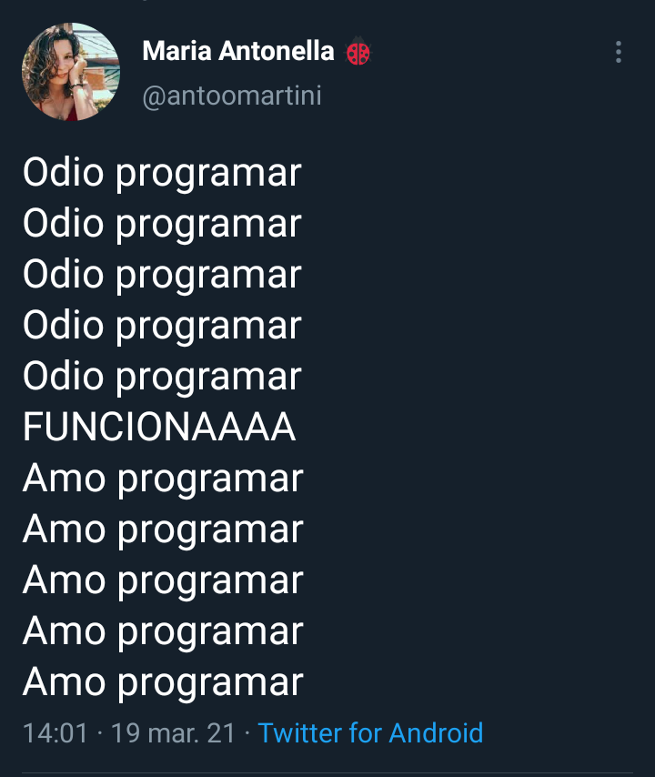
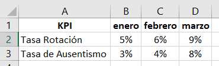

```{r setup, include=FALSE, message=FALSE, warning=FALSE}
library(learnr)
knitr::opts_chunk$set(echo = FALSE)

# Datasets
library(openxlsx)
library(tidyverse)

#carpeta <- "inst/tutorials/sesion1/"

plantel <- read.xlsx("plantel.xlsx")
salarios <- read.xlsx("puestos.xlsx")

empleados <- left_join(plantel, salarios, by = "ID")

mensualizados <- plantel %>% 
  left_join(salarios, by ="ID") %>% 
  filter(!is.na(PUESTO))

encuesta <- read.csv("https://raw.githubusercontent.com/r4hr/kiwi2020/main/rh_ar.csv",
                     sep = ";")
```

## Sesión 1 - Introducción a Tidyverse

{width="40%"}

Este tutorial corresponde a la clase de **Introducción a la limpieza de datos con Tidyverse** del curso Introducción a R para RRHH de [Data 4HR](https://data-4hr.com/capacitacion/curso-introduccion-r-para-rrhh/).

Con este tutorial vas a poder practicar algunas de las funciones de `tidyverse`, una colección de paquetes diseñadas para *"domar datos"*: limpiar, filtrar, seleccionar, y transformas los datos para que se ajusten a nuestras necesidades de análisis.

Recordá que contás con los siguientes canales de comunicación para hacer consultas:

🤝 [Slack](https://join.slack.com/t/r4hr/shared_invite/zt-ocriyx5e-nqXuwWeDyOKm2ICUJjhu6g)

📡 [Discord](https://discord.gg/3xhNH6kRad)

En Slack tenemos un canal llamado **#auxilio** donde podés hacer todas las consultas que quieras.

Muchas gracias!

**Sergio Garcia Mora \| Data 4HR**


**Sergio Garcia Mora** **Data 4HR**

## Proyectos

Los proyectos son una de las grandes ventajas de trabajar con RStudio. Internamente crea carpetas dentro de *Mis documentos* (o la carpeta que elijas) haciendo que tu código y los datos estén almacenados organizadamente, redireccionando las carpetas de trabajo cada vez que cambias de proyecto.

Para crear un proyecto primero hay que entrar en *File -\> New Project* y se abrirá una ventana como la siguiente:

{width="348"}

Elegimos la opción *New Directory* en la ventana siguiente volvemos a hacer click en *New Project* y luego en la siguiente ventana, podemos elegir el nombre del proyecto, elegir la carpeta en la que queremos guardarlo con el botón *Browse*.


Arriba a la derecha, debajo del ícono para cerrar el programa RStudio va a aparecer un ícono de un cubo celeste con el nombre del proyecto que acabamos de crear. Desde el menú desplegable podemos intercambiar de proyectos cada vez que lo necesitemos.

## Repaso: Objetos

R es un lenguaje orientado a objetos. Esto quiere decir que las tablas, valores y resultados, les podemos dar un nombre, y utilizar ese nombre para que sea más fácil operar y programar los scripts.

> Recomendación: Poné nombres claros y descriptivos a los objetos, que sean breves, pero a su vez que den una pista sobre lo que contiene. Recordá que acá lo más importante no es que R entienda lo que estás haciendo, sino que lo pueda entender otra persona, e incluso vos mismo cuando vuelvas a leer tu propio script dentro de 6 meses o un año.

Algo interesante con los objetos es que podemos utilizarlos y operar con ellos en los scripts.

Para crear un objeto podemos usar el símbolo `<-` (la *"flechita"*), o bien el signo igual `=`. En R preferimos usar la *flechita* como asignador porque el signo igual se usa mucho en la modificación de parámetros de funciones.

### Ejercicio

El costo de la rotación según el [Dr. Jac Fitz-enz](https://www.linkedin.com/in/dr-jac-fitzenz-89782a55/), el padre de la rotación en RRHH es de 6 sueldos para personas de convenio o semi seniors, o hasta **un sueldo anual** en el caso de managers o profesionales.

Es decir que la forma de calcular el costo de la rotación anual, asumiendo que estamos haciendo un cálculo conservador (6 meses) es:

\$ Sueldo Promedio x 6 x Cantidad Bajas \$

Así con las siguientes presunciones vamos a calcular el costo de rotación de tu organización.

-   Crea un objeto que se llame `sueldo_referencia` cuyo monto sea de USD 1.000.
-   Crea un objeto llamado `bajas` con la cantidad de personas desvinculadas. Tomá el número de egresos de la compañía en la que trabajas en los últimos 12 meses, o simplemente inventa un número cualquiera.

Usa los objetos para calcular el costo de rotación.

```{r objeto, exercise = TRUE, exercise.lines = 9}
# Crea los valores de referencia
sueldo_referencia <- 1000
bajas ___ ______

# Calcular el costo de rotación multiplicando ambos objetos por 6
costo_rotacion <- sueldo_referencia * ___ * _______

# Ver el resultado
costo_rotacion
```

```{r objeto-hint-1}
# Asigna el elemento 'bajas' un valor cualquiera. Por ejemplo, las desvinculaciones en tu empresa en los últimos 12 meses 
# Para calcular el costo de rotación multiplica sueldo_referencia * 6 * bajas
```

```{r objeto-hint-2}
# Crea los valores de referencia
sueldo_referencia <- 1000
bajas <- 18

# Calcular el costo de rotación multiplicando ambos objetos por 6
costo_rotacion <- sueldo_referencia * 6 * bajas

# Ver el resultado
costo_rotacion
```

## Repaso: Vectores

Los vectores son conjuntos de datos. Los creamos con una función llamada `c()` que significa *combine* (combinar).

Por ejemplo:

```{r vec-ej1}
# Vector numérico
numeros <- c(16, 8, 42)

# Vector de texto
texto <- c("RH", "People Analytics", "IA")

# Ver sus contenidos
numeros
texto
```

쯈ué tipo de vector genera este código?

```{r vec-ej2, eval=FALSE}
ejercicio <- c("1", 7, 9)
```

```{r vec-quizz}
quiz(
  question("쯈ué tipo de vector genera el código anterior?",
           answer("Numérico", message = "Si bien son tres valores numéricos, el hecho de que el primero esté entre comillas, hace que R lo considere un tipo de dato character o de texto"),
           answer("Texto", correct = TRUE, message = "Correcto! Cuando a un número lo escribimos entre comillas R lo interpreta como texto"),
           submit_button = "Enviar respuesta",
           try_again_button = "Intenta de nuevo",
           allow_retry = TRUE
)
)
```

Para seleccionar elementos de un vector tenemos que seguir la lógica `nombre_vector[numero_posicion]`.

```{r vec-ej3, exercise = TRUE, exercise.lines =8}
# Crear un vector
area <- c("RH", "HR Analytics", "IA")

# Seleccionar el segundo elemento
_______

# Modificar el segundo elemento por 'People Analytics'
____[__] <- ____________
```

```{r vec-ej3-hint-1}
# Para elegir un elemento de un vector pone el nombre del vector y entre corchetes el número del elemento
# Para asignar un valor hay que usar la estructura nombre_vector[elemento] y asignar el nuevo elemento

```

```{r vec-ej3-hint-2}
# Crear un vector
area <- c("RH", "HR Analytics", "IA")

# Seleccionar el segundo elemento
area[2]

# Modificar el segundo elemento por 'People Analytics'
area[2] <- "People Analytics"
```


## Repaso: Data frames

Los *data frames* son tablas, como las que encontramos en cualquier archivo de Excel por ejemplo, en donde tenemos filas (observaciones) y columnas (variables).

Si tenemos vectores que tienen la misma cantidad de elementos, podemos usar la función `data.frame()` pasando los nombres de los vectores dentro de la función.

Por ejemplo, creemos dos vectores, uno con el nombre de las áreas de `RH`, `Finanzas` y `Operaciones`, y otro con la cantidad de colaboradores, por ejemplo: `6`, `12`, `24` respectivamente. Luego con esos vectores podemos crear un data frame llamado `dotacion`.

```{r df-1, exercise = TRUE, exercise.lines = 9}
# Crear los vectores 'area' y 'cantidad'
area <- c("RH", _______, ______)
cantidad ___ _(____, _____, _____)

# Crear el data frame usando la función data.frame()
_______ <-  data.frame(________, ________)

# Ver el data frame
___________________
```

```{r df-1-hint-1}
# Asigna los 3 elementos a cada vector

# Crea un nuevo objeto llamado 'dotacion' 

# Escribe dentro del data frame los nombres de los vectores

# Para ver el data frame escribe su nombre
```

```{r df-1-hint-2}
# Crear los vectores 'area' y 'cantidad'
area <- c("RH", "Finanzas", "Operaciones")
cantidad <- c(6, 12, 24)

# Crear el data frame usando la función data.frame()
dotacion <- data.frame(area, cantidad)

# Ver el data frame
dotacion
```


Corre la siguiente línea de código y responde la pregunta a continuación:

```{r df-2, exercise=TRUE}
# El data frame plantel ya está cargado
str(plantel) # Brinda información sobre la estructura del data frame
```

Responde la pregunta:

```{r df-3}
quiz(
  question(
    
  )
)
```


## Paquetes

Los paquetes o librerías son extensiones desarrolladas por la comunidad o por empresas que facilitan el uso de R y expanden sus capacidades. En este encuentro vamos a usar los siguientes paquetes:

-   `readxl`: Desarrollado por Hadley Wickham and Jennifer Bryan. [Link a la web](https://CRAN.R-project.org/package=readxl).
-   `openxlsx`: Desarrollado por Philipp Schauberger and Alexander Walker. [Link a la web](https://CRAN.R-project.org/package=openxlsx).
-   `tidyverse`: Desarrollado por Hadley Wickham y muchos más. [Link a la web](https://www.tidyverse.org/).

Este último paquete, `tidyverse` es una colección de paquetes que permiten realizar muchas tareas de exploración, limpieza y transformación de datos.

Para utilizar un paquete, lo primero que tenemos que hacer es instalarlos. Eso lo hacemos con la función `install.packages()` y dentro del paréntesis tenemos que poner el nombre del paquete. **Tengan en cuenta que:**

-   R es un lenguaje *case sensitive* o sea que hay que prestar atención a mayúsculas y minúsculas.

-   Para instalar los paquetes hay que usar comillas

Este es un paso que hacemos una sola vez por computadora.

Para correr el código se tienen que parar en la línea de código que quieren usar y apretar las teclas `Ctrl` + `Enter` o bien el triángulo verde (como si fuera un ícono de *"Play"* ▶️)

```{r paquetes, eval = FALSE}
# Instalar los paquetes readxl y tidyverse
install.packages("tidyverse")
install.packages("readxl")
```

Esto lo que hace es instalar paquetes desde [CRAN](https://cran.r-project.org/), que es un repositorio donde se publican los paquetes, asegurando un estándar de calidad y de documentación que hace que trabajar con cualquier paquete de CRAN sea seguro.

Para usar las funciones de los paquetes que instalamos, ahora tenemos que **cargarlos.** Esto lo que hace es de alguna manera *"activar"* el paquete y que podamos empezar sus funciones.

Para cargar un paquete tenemos que usar la función `library()`. Recuerden prestar atención a las mayúsculas y minúsculas. Ahora no son necesarias las comillas.

```{r carga-paquetes, exercise = TRUE}
# Cargar los paquetes readxl y tidyverse
library(____)  # Leer archivos de Excel en R


```
```{r carga-paquetes-hint1}
# Tenés que usar la función library() y dentro de los paréntesis escribir readxl

```
```{r carga-paquetes-solution}
# Cargar los paquetes readxl y tidyverse
library(readxl) # Leer archivos de Excel en R
```


Una de las formas en las que nos damos cuenta que el paquete está instalado es cuando empezamos a escribir su nombre y nos aparece el nombre del paquete para autocompletar. Esta es una de las ventajas de trabajar en RStudio.


> Recuerden:
>
> La instalación de los paquetes se hace **una sola vez** por computadora.
>
> La carga de los paquetese se hace **cada vez que se abre** un script.

### Preguntas

En este primer ejercicio tendrás que corregir el código para activar el paquete `tidyverse`. 쮺uál es la función que tenés que usar para lograrlo?

```{r activar-paquete, exercise = TRUE, exercise.lines = 4}
_______(tidyverse)
```

```{r activar-paquete-hint}
# Para instalar o activar un paquete revisa que el nombre no tenga errores de tipeo.
# R es case sensitive, controla que las mayúsculas o minúsculas estén bien.
# Recuerda que no son necesarias las comillas.
library(tidyverse)
```

```{r paquetes}
quiz(
  question("쮺uántas veces hay que instalar un paquete?",
           answer("Una sola vez por computadora", correct = TRUE, "Así es! Este es un proceso que se hace por única vez en cada máquina en la que trabajes"),
           answer("Cada vez que corremos un script", message = "La instalación sólo es necesaria una sola vez"),
           answer("Cada vez que creamos un proyecto nuevo", message = "No importa la cantidad de proyectos. Cada vez que instalamos un paquete queda disponible para todos los proyectos que creemos."),
           answer("Depende", message = "[Depende](https://youtu.be/dgf5QlcyTFY) es una bonita canción de Jarabe de Palo y en este caso es una respuesta incorrecta ;p"),
           submit_button = "Enviar respuesta",
           try_again_button = "Intenta de nuevo",
           allow_retry = TRUE),
  question("Cada vez que abro un script es necesario correr la función `library()`",
           answer("Verdadero", correct = TRUE, message = "Si, es correcto, cada vez que abrimos R tenemos que correr el script desde el principio y vover a activar los paquetes."),
           answer("Falso", message = "Cada vez que abrimos el script hay que correr todo el código desde el principio y activar el paquete con la función library"),
           submit_button = "Enviar respuesta",
           try_again_button = "Intenta de nuevo",
           allow_retry = TRUE),
  question("쯇or qué aparece este mensaje de error?: 'no se pudo encontrar la función _________'",
  answer("Porque el paquete no está instalado", message = "Es posible, pero hay otra respuesta más específica"),
  answer("Porque no cargamos el paquete con la función library() antes", correct = TRUE, message = "Perfecto! La función library() activa las funciones"),
  answer("Porque está mal escrito el nombre del paquete", message = "Si hay un error de tipeo el mensaje diría: there is no package called ___"),
           submit_button = "Enviar respuesta",
           try_again_button = "Intenta de nuevo",
           allow_retry = TRUE
))
```

Es un buen momento para [poner una pausa](https://youtu.be/xxLhW_hnrW4).

## Tidyverse

{width="438"}

`tidyverse` es un conjunto de paquetes, diseñados principalmente para la manipulación y transformación de datos. También es un estándar, conocido como *tidy data* en el cual sus principios son:

* Cada variable debe tener su propia columna.
* Cada observación debe estar en su propia fila.
* Cada valor debe estar en su propia celda.


Un ejemplo típico de lo que tenemos que hacer es cuando en un archivo de Excel nos encontramos con algo así:



Para R, enero, febrero, y marzo son valores de una variable que se llamaría mes. Si necesito hacer cálculos o un gráfico con sus resultados necesito poner esa variable en una columna en vez de en un fila como está ahora.


En este primer curso trabajamos mucho con el paquete `dplyr` que nos permite filtrar datos, unir datos de diversas fuentes, y hacer las transformaciones necesarias para poder realizar nuestros análisis. Para saber más del resto de los paquetes de tidyverse buscá en el [Google Drive](https://drive.google.com/drive/folders/1Qck3z_t6XLRXb2vbN-00931DgdJZ0yse?usp=sharing) de **R4HR Club de R para RRHH** o mirá los videos en [YouTube](https://youtube.com/playlist?list=PLZuVytUJrxQlcqu6l-P3ou4vV2mRJU2Ka).

## Funciones o verbos de dplyr

Tené a mano el [cheatsheet de data-wrangling](https://drive.google.com/file/d/1ViFJRuby7FTDgjWvp9P6hKO3MEHgeH_M/view?usp=sharing) en castellano. Los cheatsheets (machetes, cola, trencito, torpedo, chuleta, copiatín, plage, chanchullo) son ayuda memorias con las principales funciones de un paquete.

Las funciones que vimos en el curso (que no son todas las del paquete) son:

-   **left_join():** Permite unir información de varias tablas. Los sistemas de gestión de RRHH tienen por ejemplo una tabla que tiene información básica de las personas (nombre y apellido, fecha de nacimiento, etc.), otra tabla con la remuneración base y los conceptos salariales que le correspondan, y podría tener otras tablas con las evaluaciones de desempeño y así sucesivamente. Hay muchos tipos distintos de `join`, pero a los fines prácticos de este curso nos quedaremos con `left_join()` que es una función equivalente a realizar un *buscarv* o un *vlookup* en Excel.

-   **select():** Permite seleccionar las columnas con las que queremos trabajar. También permite acomodarlas en el orden que las necesitemos, y también la podemos usar para descartar variables que no necesitemos.

-   **filter():** Nos permite filtrar las filas que cumplan con una o más condiciones. Por ejemplo, si queremos hacer un análisis de un grupo específico de empleados (por ejemplo Líderes), vamos a filtrar de una tabla de empleados, los empleados que tengan una posición de liderazgo.

-   **group_by():** Por ejemplo, si quiero analizar los sueldos promedios por puesto, un paso previo que tenemos que hacer es *agrupar* los datos por la variable `puesto` antes de calcular el promedio. Es un paso previo que realizaremos siempre antes de hacer algún cálculo de resumen estadístico.

-   **summarise():** Es la función que nos permite hacer cálculos de resumen estadístico (calcular promedios, medianas, contar filas, desvíos estándares, etc.). Lo

-   **mutate():** Uno de los principales usos de `mutate()` es el de crear una nueva variable (columna) en nuestro dataframe original en base a alguna columna que ya exista. Por ejemplo, si tengo una columna que contenga el sueldo básico mensual de un empleado, podría añadir otra columna que calcule las cargas sociales, o bien el costo anual de cada colaborador/a. Otro uso que se le da es para modificar las características de una variable (lo veremos en un ejercicio).

## El "pipe" %>%

Uno de los paquetes de tidyverse, el paquete `dplyr` aporta un símbolo conocido como *"pipe"* `%>%` (*tubo* en inglés). El atajo de teclado es con las teclas *Ctrl + Mayús + M* en Windows, o *Cmd + Shift + M* en Mac.

A partir de la versión 4.1.0 de R, hay una versión nativa de R del *pipe* cuyo símbolo es `|>` pero en este curso utilizaremos la versión del paquete `dplyr`.

Lo que nos permite este *pipe* o *tubo* es escribir los códigos en secuencias, haciendo muchísimo más fácil escribir y leer secuencias de funciones que incluyan varios pasos.

Imaginemos que queremos comprar regalos por el día del niño a todos los empleados de la empresa que tengan hijos. Para esto, necesitamos un listado de los empleados que tengan hijos, ordenados por sector. Para lograr esto los pasos que tenemos que seguir son:

1.  Seleccionar las columnas `AREA`, `ID` e `HIJOS` del dataframe `nomina`.

2.  Filtrar los empleados que tengan hijos (donde en la columna `HIJOS` el valor sea mayor que cero.

3.  Ordenar los resultados por `AREA`.

Veamos cómo se ve el código de R sin el uso del pipe `%>%`:

```{r ej3, echo=TRUE, eval=FALSE}
# Ejemplo de funciones anidadas sin usar el pipe
arrange(filter(select(nomina, AREA,ID, HIJOS), HIJOS > 0), AREA)
```

Ahora veamos el siguiente código, que logra lo mismo que antes, pero usando el pipe `%>%`

```{r ej4, echo=TRUE, eval=FALSE}
# Ejemplo de funciones anidadas usando el pipe
nomina %>% 
  select(AREA, ID, HIJOS) %>% 
  filter(HIJOS > 0) %>% 
  arrange(AREA)
```

쮺uál te parece la forma más sencilla de entender la secuencia de análisis?

## Unir datos con left_join()

Tenemos dos dataframes, uno con información general de los empleados. El dataframe `plantel` contiene 8 variables:

-   ID: el dato de identificación única de cada persona de la empresa.

-   ANTIGUEDAD: Los años de permanencia en la organización.

-   EDAD: La edad de los colaboradores.

-   ESTADO_CIVIL: El estado civil de los trabajadores/as de la compañía.

-   HIJOS: La cantidad de hijos que tiene cada colaborador.

-   AREA: El sector en el que trabaja cada persona.

-   ID_CAT: La clave identificatoria de las categorías de los trabajadores.

-   N_CATEG: El nombre de cada categoría.

Veamos la estructura del dataframe.

```{r str1, exercise = TRUE}
#Correr este código
str(plantel)
```

El siguiente dataframe, `salarios` contiene los siguientes campos:

-   ID: el campo que nos permitirá unir las diferentes tablas.

-   PUESTO: el nombre real del puesto que ocupa cada persona.

-   SUELDO: La remuneración básica mensual de cada empleado.

Prestá atención a la estructura del archivo y contesta la siguiente pregunta.

```{r str2, exercise = TRUE}
str(salarios)
```

```{r left-q}
quiz(
  question("쮺uántas filas y columnas tiene el dataframe 'salarios'?",
  answer("135 columnas y 3 variables", message = "Las observaciones son las filas y las variables son las columnas de una tabla o data frame."),
  answer("130 filas y 10 variables", message = "Mirá de nuevo el resultado de la estructura del dataframe salarios. Primero indica las observaciones, y luego las variables"),
  answer("135 filas y 3 columnas", correct = TRUE, message = "Muy bien!"),
  submit_button = "Enviar respuesta",
  try_again_button = "Intenta de nuevo",
  allow_retry = TRUE
))
```

Ahora vamos a unir ambos dataframes en uno solo para poder hacer nuestros análisis.

Usaremos la función `left_join()` para agregar al dataframe `plantel` los datos del dataframe `salarios.`

```{r leftjoin, exercise = TRUE, exercise.lines=7}
# Agrega al dataframe 'plantel' el dataframe 'salarios'
empleados <- left____(_____, _____, by = "ID")

# Ver la estructura del nuevo dataframe
___(__________)
```

```{r leftjoin-hint}
# Recuerda poner la función left_join()
# Añade al dataframe 'plantel', los datos de 'salarios' por la columna ID
# Cuidado con mayúsculas y minúsculas
# Para ver la estructura del data frame usa la función str(nombre_dataframe)
```

```{r leftjoin-solution}
empleados <- left_join(plantel, salarios, by = "ID")

# Ver la estructura del nuevo dataframe
str(empleados)
```

Hay muchos tipos de `join`, por ejemplo `right_join`, `inner_join`, `anti_join`, `full_join`, que no serán parte de este curso.

## select()

Con la función `select()` podemos elegir las columnas que nos interesa trabajar. Por ejemplo, prueba de correr la función `str()` con el nuevo dataframe `empleados`.

Esta es una función particularmente útil cuando trabajamos con datasets muy grandes que contienen muchas columnas y filas, que mejora los tiempos de procesamiento de datos.

```{r str, exercise = TRUE, exercise.lines = 4}
# Corre esta línea de código
str(empleados)
```

Las variables `EDAD`, `ESTADO_CIVIL` e `HIJOS` no tienen mucho sentido para un análisis salarial. En el próximo ejercicio, selecciona las columnas `ID`, `AREA`, `PUESTO`, `SUELDO` y `ANTIGUEDAD` y guarda la selección en un objeto llamado `mensuales.`

```{r select, exercise = TRUE, exercise.lines = 4}
mensuales <- empleados %>% 
  _______(___, ___, ____, ____)
```

```{r select-hint-1}
# Usa la función select()
# Dentro del paréntesis pon los nombres de las variables que nos interesa analizar
```

```{r select-hint-2}
mensuales <- empleados %>%          # Crea un nuevo dataframe con los datos de empleados
  select(ID, AREA, PUESTO, SUELDO)  # Selecciona las variables de interés
```

### Pregunta

Varias funciones de `dplyr` tienen algunas variantes auxiliares. 쯇or ejemplo, qué creés que hace el siguiente código?

```{r qselect, echo=TRUE, eval=FALSE}
plantel %>% 
  select_if(is.numeric)
```

```{r qselect1}
quiz(question("쯈ué hará la función select_if(is.numeric)?",
         answer("Selecciona las columnas si son numéricas", 
                correct = TRUE, 
                message = "Perfecto, select_if(is.numeric) seleccionará todas las columnas numéricas"),
         answer("Selecciona las columnas si no son numéricas",
                message = "Incorrecto, todo lo contrario"),
         answer("No es una función real",
                message = "Incorrecto, es una función real, y en algunos casos muy práctica"),
         submit_button = "Enviar respuesta",
         try_again_button = "Intenta de nuevo",
         allow_retry = TRUE)
         )
```

## filter()

La función `select()` elige columnas, `filter()` por otro lado, nos permite seleccionar filas que coincidan con un criterio de filtro para determinar qué casos pasan cuáles no lo hacen.

Para trabajar con filter vamos a necesitar algunos *operadores lógicos*:

```{r filter}
library(gt)
gt(
  data.frame(
    "Símbolo" = c("<", "<=", ">", ">=", "==", "!=", "&", "|"),
    "Significado" = c("menor a", "menor o igual a", "mayor a", "mayor o igual a",
                "igual a", "distinto a", "y (and)", "o (or)")
  )
) %>% 
  cols_align(
    align = "center",
    columns = everything()
  )
```

Hay que prestar mucha atención cuando decimos coloquialmente por ejemplo *"filtrar área igual a RRHH"* porque el símbolo que hay que usar es `==` y no `=`. 쯇or qué?

-   ✔️`AREA == "RRHH"` va a filtrar todas las filas de la columna *AREA* que digan *RRHH*.

-   ❌`AREA = "RRHH"` va a crear un objeto en la memoria que se llamará *AREA* y cuyo valor será *RRHH*

En mi opinión, es también un punto a favor del uso de la *"flechita"* (`<-`) para crear objetos, ya que el signo igual lo usamos para modificar parámetros dentro de las funciones.

Entonces, 쯖칩mo hago para seleccionar a las personas del `AREA` de `FINANZAS`?

```{r sel1, exercise=TRUE, exercise.lines=6}
# Primero indico el nombre del dataframe
empleados %>% 
# Luego ejecuto el filtro  
  filter(AREA __ "FINANZAS")
```

```{r sel1-hint}
# Revisa la tabla de operadores lógicos de más arriba
# 쮺uántos símbolos 'igual' (=) necesitás? 1 o 2?
```

```{r sel1-solution}
# Primero indico el nombre del dataframe
empleados %>% 
# Luego ejecuto el filtro  
  filter(AREA == "FINANZAS")
```

Es importante que cuando estemos filtrando una variable categórica usemos las comillas para nombrar la condición por la que queremos filtrar los datos.

El signo de exclamación (`!`) sirve en R como un operador de negación. Por ejemplo, si escribimos:

```{r sel-ejemplo, echo=TRUE, eval=FALSE}
empleados %>% 
  filter(AREA != "RRHH")
```

Lo que obtendremos serán todos los empleados que **no sean de RRHH**.

Un error frecuente que cometemos cuando estamos aprendiendo sobre `tidyverse` es usar la función `filter()` con un sólo signo igual. Probemos correr la siguiente línea de código:

## group_by() y summarise()

## mutate()
