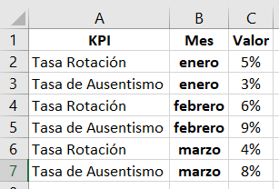
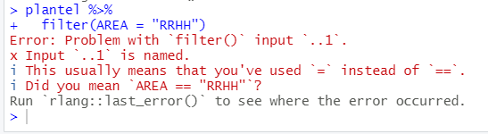
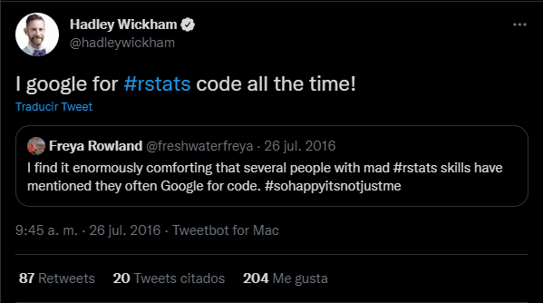
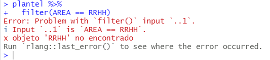

```{r setup, include=FALSE, message=FALSE, warning=FALSE}
library(learnr)
knitr::opts_chunk$set(echo = FALSE)

# Datasets
library(openxlsx)
library(tidyverse)

#carpeta <- "inst/tutorials/sesion1/"

plantel <- read.xlsx("plantel.xlsx")
salarios <- read.xlsx("puestos.xlsx")

empleados <- left_join(plantel, salarios, by = "ID")

mensuales <- plantel %>% 
  left_join(salarios, by ="ID") %>% 
  filter(!is.na(PUESTO))

encuesta <- read.csv("https://raw.githubusercontent.com/r4hr/kiwi2020/main/rh_ar.csv",
                     sep = ";",
                     encoding = "UTF-8")
```

## Sesión 1 - Introducción a Tidyverse

{width="40%"}

Este tutorial corresponde a la clase de **Introducción a la limpieza de datos con Tidyverse** del curso Introducción a R para RRHH de [Data 4HR](https://data-4hr.com/capacitacion/curso-introduccion-r-para-rrhh/).

Con este tutorial vas a poder practicar algunas de las funciones de `tidyverse`, una colección de paquetes diseñadas para *"domar datos"*: limpiar, filtrar, seleccionar, y transformas los datos para que se ajusten a nuestras necesidades de análisis.

Recordá que contás con los siguientes canales de comunicación para hacer consultas:

🤝 [Slack](https://join.slack.com/t/r4hr/shared_invite/zt-ocriyx5e-nqXuwWeDyOKm2ICUJjhu6g)

📡 [Discord](https://discord.gg/3xhNH6kRad)

En Slack tenemos un canal llamado **#auxilio** donde podés hacer todas las consultas que quieras.

Muchas gracias!

**Sergio Garcia Mora \| Data 4HR**


**Sergio Garcia Mora** **Data 4HR**

## Proyectos

Los proyectos son una de las grandes ventajas de trabajar con RStudio. Internamente crea carpetas dentro de *Mis documentos* (o la carpeta que elijas) haciendo que tu código y los datos estén almacenados organizadamente, redireccionando las carpetas de trabajo cada vez que cambias de proyecto.

Para crear un proyecto primero hay que entrar en *File -> New Project* y se abrirá una ventana como la siguiente:

{width="348"}

Elegimos la opción *New Directory* en la ventana siguiente volvemos a hacer click en *New Project* y luego en la siguiente ventana, podemos elegir el nombre del proyecto, elegir la carpeta en la que queremos guardarlo con el botón *Browse*.


Arriba a la derecha, debajo del ícono para cerrar el programa RStudio va a aparecer un ícono de un cubo celeste con el nombre del proyecto que acabamos de crear. Desde el menú desplegable podemos intercambiar de proyectos cada vez que lo necesitemos.

## Repaso: Objetos

R es un lenguaje orientado a objetos. Esto quiere decir que las tablas, valores y resultados, les podemos dar un nombre, y utilizar ese nombre para que sea más fácil operar y programar los scripts.

> Recomendación: Poné nombres claros y descriptivos a los objetos, que sean breves, pero a su vez que den una pista sobre lo que contiene. Recordá que acá lo más importante no es que R entienda lo que estás haciendo, sino que lo pueda entender otra persona, e incluso vos mismo cuando vuelvas a leer tu propio script dentro de 6 meses o un año.

Algo interesante con los objetos es que podemos utilizarlos y operar con ellos en los scripts.

Para crear un objeto podemos usar el símbolo `<-` (la *"flechita"*), o bien el signo igual `=`. En R preferimos usar la *flechita* como asignador porque el signo igual se usa mucho en la modificación de parámetros de funciones.

### Ejercicio

El costo de la rotación según el [Dr. Jac Fitz-enz](https://www.linkedin.com/in/dr-jac-fitzenz-89782a55/), el padre de la rotación en RRHH es de 6 sueldos para personas de convenio o semi seniors, o hasta **un sueldo anual** en el caso de managers o profesionales.

Es decir que la forma de calcular el costo de la rotación anual, asumiendo que estamos haciendo un cálculo conservador (6 meses) es:

\$ Sueldo Promedio x 6 x Cantidad Bajas \$

Así con las siguientes presunciones vamos a calcular el costo de rotación de tu organización.

-   Crea un objeto que se llame `sueldo_referencia` cuyo monto sea de USD 1.000.
-   Crea un objeto llamado `bajas` con la cantidad de personas desvinculadas. Tomá el número de egresos de la compañía en la que trabajas en los últimos 12 meses, o simplemente inventa un número cualquiera.

Usa los objetos para calcular el costo de rotación.

```{r objeto, exercise = TRUE, exercise.lines = 9}
# Crea los valores de referencia
sueldo_referencia <- 1000
bajas ___ ______

# Calcular el costo de rotación multiplicando ambos objetos por 6
costo_rotacion <- sueldo_referencia * ___ * _______

# Ver el resultado
costo_rotacion
```

```{r objeto-hint-1}
# Asigna el elemento 'bajas' un valor cualquiera. Por ejemplo, las desvinculaciones en tu empresa en los últimos 12 meses 
# Para calcular el costo de rotación multiplica sueldo_referencia * 6 * bajas
```

```{r objeto-hint-2}
# Crea los valores de referencia
sueldo_referencia <- 1000
bajas <- 18

# Calcular el costo de rotación multiplicando ambos objetos por 6
costo_rotacion <- sueldo_referencia * 6 * bajas

# Ver el resultado
costo_rotacion
```

## Repaso: Vectores

Los vectores son conjuntos de datos. Los creamos con una función llamada `c()` que significa *combine* (combinar).

Por ejemplo:

```{r vec-ej1, echo=TRUE}
# Vector numérico
numeros <- c(16, 8, 42)

# Vector de texto
texto <- c("RH", "People Analytics", "IA")

# Ver sus contenidos
numeros
texto
```

**Pregunta:** ¿Qué tipo de vector genera este código?

```{r vec-ej2, eval=FALSE, echo=TRUE}
ejercicio <- c("1", 7, 9)
```

```{r vec-quizz}
quiz(
  question("¿Qué tipo de vector genera el código anterior?",
           answer("Numérico", message = "Si bien son tres valores numéricos, el hecho de que el primero esté entre comillas, hace que R lo considere un tipo de dato character o de texto"),
           answer("Texto", correct = TRUE, message = "Correcto! Cuando a un número lo escribimos entre comillas R lo interpreta como texto"),
           submit_button = "Enviar respuesta",
           try_again_button = "Intenta de nuevo",
           allow_retry = TRUE
)
)
```

Para seleccionar elementos de un vector tenemos que seguir la lógica `nombre_vector[numero_posicion]`.

```{r vec-ej3, exercise = TRUE, exercise.lines =12}
# Crear un vector
area <- c("RH", "HR Analytics", "IA")

# Seleccionar el segundo elemento
_______

# Modificar el segundo elemento por 'People Analytics'
____[__] <- ____________

# Ver el vector actualizado
```

```{r vec-ej3-hint-1}
# Para elegir un elemento de un vector pone el nombre del vector y entre corchetes el número del elemento
# Para asignar un valor hay que usar la estructura nombre_vector[elemento] y asignar el nuevo elemento

```

```{r vec-ej3-hint-2}
# Crear un vector
area <- c("RH", "HR Analytics", "IA")

# Seleccionar el segundo elemento
area[2]

# Modificar el segundo elemento por 'People Analytics'
area[2] <- "People Analytics"

# Ver el vector actualizado
area
```

## Repaso: Data frames

Los *data frames* son tablas, como las que encontramos en cualquier archivo de Excel por ejemplo, en donde tenemos filas (observaciones) y columnas (variables).

Si tenemos vectores que tienen la misma cantidad de elementos, podemos usar la función `data.frame()` pasando los nombres de los vectores dentro de la función.

Por ejemplo, creemos dos vectores, uno con el nombre de las áreas de `RH`, `Finanzas` y `Operaciones`, y otro con la cantidad de colaboradores, por ejemplo: `6`, `12`, `24` respectivamente. Luego con esos vectores podemos crear un data frame llamado `dotacion`.

```{r df-1, exercise = TRUE, exercise.lines = 9}
# Crear los vectores 'area' y 'cantidad'
area <- c("RH", _______, ______)
cantidad ___ _(____, _____, _____)

# Crear el data frame usando la función data.frame()
_______ <-  data.frame(________, ________)

# Ver el data frame
___________________
```

```{r df-1-hint-1}
# Asigna los 3 elementos a cada vector

# Crea un nuevo objeto llamado 'dotacion' 

# Escribe dentro del data frame los nombres de los vectores

# Para ver el data frame escribe su nombre
```

```{r df-1-hint-2}
# Crear los vectores 'area' y 'cantidad'
area <- c("RH", "Finanzas", "Operaciones")
cantidad <- c(6, 12, 24)

# Crear el data frame usando la función data.frame()
dotacion <- data.frame(area, cantidad)

# Ver el data frame
dotacion
```

Corre la siguiente línea de código y responde la pregunta a continuación:

```{r df-2, exercise=TRUE}
# El data frame plantel ya está cargado
str(plantel) # Brinda información sobre la estructura del data frame
```

Responde la pregunta:

```{r df-3}
quiz(
  question(
    "¿Cuántas filas y columnas tiene el dataframe 'plantel'?",
  answer("522 columnas y 8 variables", message = "Las observaciones son las filas y las variables son las columnas. Columna es sinónimo de variable en R."),
  answer("522 variables y 8 filas", message = "Mirá de nuevo la primera fila del resultado de la estructura del dataframe plantel. Primero indica las observaciones, y luego las variables"),
  answer("522 filas y 8 columnas", correct = TRUE, message = "Muy bien!"),
  submit_button = "Enviar respuesta",
  try_again_button = "Intenta de nuevo",
  allow_retry = TRUE
  )
)
```

## Paquetes

Los paquetes o librerías son extensiones desarrolladas por la comunidad o por empresas que facilitan el uso de R y expanden sus capacidades. En este encuentro vamos a usar los siguientes paquetes:

-   `readxl`: Desarrollado por Hadley Wickham and Jennifer Bryan. [Link a la web](https://CRAN.R-project.org/package=readxl).
-   `openxlsx`: Desarrollado por Philipp Schauberger and Alexander Walker. [Link a la web](https://CRAN.R-project.org/package=openxlsx).
-   `tidyverse`: Desarrollado por Hadley Wickham y muchos más. [Link a la web](https://www.tidyverse.org/).

Este último paquete, `tidyverse` es una colección de paquetes que permiten realizar muchas tareas de exploración, limpieza y transformación de datos.

Para utilizar un paquete, lo primero que tenemos que hacer es instalarlos. Eso lo hacemos con la función `install.packages()` y dentro del paréntesis tenemos que poner el nombre del paquete. **Tengan en cuenta que:**

-   R es un lenguaje *case sensitive* o sea que hay que prestar atención a mayúsculas y minúsculas.

-   Para instalar los paquetes hay que usar comillas

Este es un paso que hacemos una sola vez por computadora.

Para correr el código se tienen que parar en la línea de código que quieren usar y apretar las teclas `Ctrl` + `Enter` o bien el triángulo verde (como si fuera un ícono de *"Play"* ▶️)

```{r paquetes1, eval = FALSE}
# Instalar los paquetes readxl y tidyverse
install.packages("tidyverse")
install.packages("readxl")
```

Esto lo que hace es instalar paquetes desde [CRAN](https://cran.r-project.org/), que es un repositorio donde se publican los paquetes, asegurando un estándar de calidad y de documentación que hace que trabajar con cualquier paquete de CRAN sea seguro.

Para usar las funciones de los paquetes que instalamos, ahora tenemos que **cargarlos.** Esto lo que hace es de alguna manera *"activar"* el paquete y que podamos empezar sus funciones.

Para cargar un paquete tenemos que usar la función `library()`. Recuerden prestar atención a las mayúsculas y minúsculas. Ahora no son necesarias las comillas.

```{r carga-paquetes, exercise = TRUE}
# Cargar los paquetes readxl y tidyverse
library(____)  # Leer archivos de Excel en R


```

```{r carga-paquetes-hint1}
# Tenés que usar la función library() y dentro de los paréntesis escribir readxl

```

```{r carga-paquetes-solution}
# Cargar los paquetes readxl y tidyverse
library(readxl) # Leer archivos de Excel en R
```

Una de las formas en las que nos damos cuenta que el paquete está instalado es cuando empezamos a escribir su nombre y nos aparece el nombre del paquete para autocompletar. Esta es una de las ventajas de trabajar en RStudio.


> Recuerden:
>
> La instalación de los paquetes se hace **una sola vez** por computadora.
>
> La carga de los paquetese se hace **cada vez que se abre** un script.

### Preguntas

En este primer ejercicio tendrás que corregir el código para activar el paquete `tidyverse`. ¿Cuál es la función que tenés que usar para lograrlo?

```{r activar-paquete, exercise = TRUE, exercise.lines = 4}
_______(tidyverse)
```

```{r activar-paquete-hint}
# Para instalar o activar un paquete revisa que el nombre no tenga errores de tipeo.
# R es case sensitive, controla que las mayúsculas o minúsculas estén bien.
# Recuerda que no son necesarias las comillas.
library(tidyverse)
```

```{r paquetes2}
quiz(
  question("¿Cuántas veces hay que instalar un paquete?",
           answer("Una sola vez por computadora", correct = TRUE, "Así es! Este es un proceso que se hace por única vez en cada máquina en la que trabajes"),
           answer("Cada vez que corremos un script", message = "La instalación sólo es necesaria una sola vez"),
           answer("Cada vez que creamos un proyecto nuevo", message = "No importa la cantidad de proyectos. Cada vez que instalamos un paquete queda disponible para todos los proyectos que creemos."),
           answer("Depende", message = "[Depende](https://youtu.be/dgf5QlcyTFY) es una bonita canción de Jarabe de Palo y en este caso es una respuesta incorrecta ;p"),
           submit_button = "Enviar respuesta",
           try_again_button = "Intenta de nuevo",
           allow_retry = TRUE),
  question("Cada vez que abro un script es necesario correr la función `library()`",
           answer("Verdadero", correct = TRUE, message = "Si, es correcto, cada vez que abrimos R tenemos que correr el script desde el principio y vover a activar los paquetes."),
           answer("Falso", message = "Cada vez que abrimos el script hay que correr todo el código desde el principio y activar el paquete con la función library"),
           submit_button = "Enviar respuesta",
           try_again_button = "Intenta de nuevo",
           allow_retry = TRUE),
  question("¿Por qué aparece este mensaje de error?: 'no se pudo encontrar la función _________'",
  answer("Porque el paquete no está instalado", message = "Es posible, pero hay otra respuesta más específica"),
  answer("Porque no cargamos el paquete con la función library() antes", correct = TRUE, message = "Perfecto! La función library() activa las funciones"),
  answer("Porque está mal escrito el nombre del paquete", message = "Si hay un error de tipeo el mensaje diría: there is no package called ___"),
           submit_button = "Enviar respuesta",
           try_again_button = "Intenta de nuevo",
           allow_retry = TRUE
))
```

Es un buen momento para [poner una pausa](https://youtu.be/xxLhW_hnrW4).

## Tidyverse

{width="400"}

`tidyverse` es un conjunto de paquetes, diseñados principalmente para la manipulación y transformación de datos. También es un estándar, conocido como *tidy data* en el cual sus principios son:

-   Cada variable debe tener su propia columna.
-   Cada observación debe estar en su propia fila.
-   Cada valor debe estar en su propia celda.

{width="600"}

Un ejemplo típico de lo que tenemos que hacer es cuando en un archivo de Excel nos encontramos con algo así:


Para R, enero, febrero, y marzo son valores de una variable que se llamaría mes. Si necesito hacer cálculos o un gráfico con sus resultados necesito poner esa variable en una columna en vez de en un fila como está ahora.



En este primer curso trabajamos mucho con el paquete `dplyr` que nos permite filtrar datos, unir datos de diversas fuentes, y hacer las transformaciones necesarias para poder realizar nuestros análisis. Para saber más del resto de los paquetes de tidyverse buscá en el [Google Drive](https://drive.google.com/drive/folders/1Qck3z_t6XLRXb2vbN-00931DgdJZ0yse?usp=sharing) de **R4HR Club de R para RRHH** o mirá los videos en [YouTube](https://youtube.com/playlist?list=PLZuVytUJrxQlcqu6l-P3ou4vV2mRJU2Ka).

## Funciones o verbos de dplyr

Tené a mano el [cheatsheet de data-wrangling](https://drive.google.com/file/d/1ViFJRuby7FTDgjWvp9P6hKO3MEHgeH_M/view?usp=sharing) en castellano. Los cheatsheets (machetes, cola, trencito, torpedo, chuleta, copiatín, plage, chanchullo, etc.) son ayuda memoria con las principales funciones de un paquete.

Las funciones que vimos en el curso (que no son todas las del paquete) son:

-   **left_join():** Permite unir información de varias tablas. Los sistemas de gestión de RRHH tienen por ejemplo una tabla que tiene información básica de las personas (nombre y apellido, fecha de nacimiento, etc.), otra tabla con la remuneración base y los conceptos salariales que le correspondan, y podría tener otras tablas con las evaluaciones de desempeño y así sucesivamente. Hay muchos tipos distintos de `join`, pero a los fines prácticos de este curso nos quedaremos con `left_join()` que es una función equivalente a realizar un *buscarv* o un *vlookup* en Excel.

-   **select():** Permite seleccionar las columnas con las que queremos trabajar. También permite acomodarlas en el orden que las necesitemos, y también la podemos usar para descartar variables que no necesitemos.

-   **filter():** Nos permite filtrar las filas que cumplan con una o más condiciones. Por ejemplo, si queremos hacer un análisis de un grupo específico de empleados (por ejemplo Líderes), vamos a filtrar de una tabla de empleados, los empleados que tengan una posición de liderazgo.

-   **group_by():** Por ejemplo, si quiero analizar los sueldos promedios por puesto, un paso previo que tenemos que hacer es *agrupar* los datos por la variable `puesto` antes de calcular el promedio. Es un paso previo que realizaremos siempre antes de hacer algún cálculo de resumen estadístico.

-   **summarise():** Es la función que nos permite hacer cálculos de resumen estadístico (calcular promedios, medianas, contar filas, desvíos estándares, etc.). Lo

-   **mutate():** Uno de los principales usos de `mutate()` es el de crear una nueva variable (columna) en nuestro dataframe original en base a alguna columna que ya exista. Por ejemplo, si tengo una columna que contenga el sueldo básico mensual de un empleado, podría añadir otra columna que calcule las cargas sociales, o bien el costo anual de cada colaborador/a. Otro uso que se le da es para modificar las características de una variable (lo veremos en un ejercicio).

## El "pipe" %>%

Uno de los paquetes de tidyverse, el paquete `dplyr` aporta un símbolo conocido como *"pipe"* `%>%` (*tubo* en inglés). El atajo de teclado es con las teclas *Ctrl +Shift +M* en Windows, o *Cmd + Shift + M* en Mac.

A partir de la versión 4.1.0 de R, hay una versión nativa de R del *pipe* cuyo símbolo es `|>` pero en este curso utilizaremos la versión del paquete `dplyr`.

Lo que nos permite este *pipe* o *tubo* es escribir los códigos en secuencias, haciendo muchísimo más fácil escribir y leer secuencias de funciones que incluyan varios pasos.

Imaginemos que queremos comprar regalos por el día del niño a todos los empleados de la empresa que tengan hijos. Para esto, necesitamos un listado de los empleados que tengan hijos, ordenados por sector. Para lograr esto los pasos que tenemos que seguir son:

1.  Seleccionar las columnas `AREA`, `ID` e `HIJOS` del dataframe `nomina`.

2.  Filtrar los empleados que tengan hijos (donde en la columna `HIJOS` el valor sea mayor que cero.

3.  Ordenar los resultados por `AREA`.

Veamos cómo se ve el código de R sin el uso del pipe `%>%`:

```{r ej3, echo=TRUE, eval=FALSE}

# Ejemplo de funciones anidadas sin usar el pipe
arrange(filter(select(nomina, AREA,ID, HIJOS), HIJOS > 0), AREA)
```

Ahora veamos el siguiente código, que logra lo mismo que antes, pero usando el pipe `%>%`

```{r ej4, echo=TRUE, eval=FALSE}
# Ejemplo de funciones anidadas usando el pipe
nomina %>% 
  select(AREA, ID, HIJOS) %>% 
  filter(HIJOS > 0) %>% 
  arrange(AREA)
```

¿Cuál de las dos formas anteriores te parece la forma más sencilla de entender la secuencia de análisis? ¿La versión sin el pipe, o con el pipe?

## Unir datos con left_join()

Tenemos dos dataframes, uno con información general de los empleados. El dataframe `plantel` contiene 8 variables:

-   ID: el dato de identificación única de cada persona de la empresa.

-   ANTIGUEDAD: Los años de permanencia en la organización.

-   EDAD: La edad de los colaboradores.

-   ESTADO_CIVIL: El estado civil de los trabajadores/as de la compañía.

-   HIJOS: La cantidad de hijos que tiene cada colaborador.

-   AREA: El sector en el que trabaja cada persona.

-   ID_CAT: La clave identificatoria de las categorías de los trabajadores.

-   N_CATEG: El nombre de cada categoría.

Veamos la estructura del dataframe.

```{r str1, exercise = TRUE}
#Correr este código
str(plantel)
```

El siguiente dataframe, `salarios` contiene los siguientes campos:

-   ID: el campo que nos permitirá unir las diferentes tablas.

-   PUESTO: el nombre real del puesto que ocupa cada persona.

-   SUELDO: La remuneración básica mensual de cada empleado.

Prestá atención a la estructura del archivo y contesta la siguiente pregunta.

```{r str2, exercise = TRUE}
str(salarios)
```

```{r left-q}
quiz(
  question("¿Cuántas filas y columnas tiene el dataframe 'salarios'?",
  answer("135 columnas y 3 variables", message = "Las observaciones son las filas y las variables son las columnas"),
  answer("130 filas y 10 variables", message = "Mirá de nuevo el resultado de la estructura del dataframe salarios. Primero indica las observaciones, y luego las variables"),
  answer("135 filas y 3 columnas", correct = TRUE, message = "Muy bien!"),
  submit_button = "Enviar respuesta",
  try_again_button = "Intenta de nuevo",
  allow_retry = TRUE
))
```

Ahora vamos a unir ambos dataframes en uno solo para poder hacer nuestros análisis.

Usaremos la función `left_join()` para agregar al dataframe `plantel` los datos del dataframe `salarios.`

```{r leftjoin, exercise = TRUE, exercise.lines=7}
# Agrega al dataframe 'plantel' el dataframe 'salarios'
empleados <- left____(_____, _____, by = "ID")

# Ver la estructura del nuevo dataframe
___(__________)
```

```{r leftjoin-hint}
# Recuerda poner la función left_join()
# Añade al dataframe 'plantel', los datos de 'salarios' por la columna ID
# Cuidado con mayúsculas y minúsculas
# Para ver la estructura del dataframe usa la función str(nombre_dataframe)
```

```{r leftjoin-solution}
empleados <- left_join(plantel, salarios, by = "ID")

# Ver la estructura del nuevo dataframe
str(empleados)
```

Hay muchos tipos de `join`, por ejemplo `right_join`, `inner_join`, `anti_join`, `full_join`, que no serán parte de este curso.

## select()

Con la función `select()` podemos elegir las columnas que nos interesa trabajar. Por ejemplo, prueba de correr la función `str()` con el nuevo dataframe `empleados`.

Esta es una función particularmente útil cuando trabajamos con datasets muy grandes que contienen muchas columnas y filas, que mejora los tiempos de procesamiento de datos.

```{r str, exercise = TRUE, exercise.lines = 5, exercise.setup="fuente"}
# Corre esta línea de código
str(empleados)
```

Las variables `EDAD`, `ESTADO_CIVIL` e `HIJOS` no tienen mucho sentido para un análisis salarial. En el próximo ejercicio, selecciona las columnas `ID`, `AREA`, `PUESTO`, `SUELDO`, y `ANTIGUEDAD` y guarda la selección en un objeto llamado `mensuales.`

```{r select, exercise = TRUE, exercise.lines = 5, exercise.setup="fuente"}
mensuales <- empleados %>% 
  _______(___, ___, ____, ____)

# Ver el resultado
_________
```

```{r select-hint}
# Usa la función select()
# Dentro del paréntesis pon los nombres de las variables que nos interesa analizar
```

```{r select-solution}
mensuales <- empleados %>%          # Crea un nuevo dataframe con los datos de empleados
  select(ID, AREA, PUESTO, SUELDO)  # Selecciona las variables de interés

# Ver el resultado
mensuales
```

### Pregunta

Varias funciones de `dplyr` tienen algunas variantes auxiliares. ¿Por ejemplo, qué creés que hace el siguiente código?

```{r qselect, echo=TRUE, eval=FALSE}
plantel %>% 
  select_if(is.numeric)
```

```{r qselect1}
quiz(question("¿Qué hará la función select_if(is.numeric)?",
         answer("Selecciona las columnas si son numéricas", 
                correct = TRUE, 
                message = "Perfecto, select_if(is.numeric) seleccionará todas las columnas numéricas"),
         answer("Selecciona las columnas si no son numéricas",
                message = "Incorrecto, todo lo contrario"),
         answer("No es una función real",
                message = "Incorrecto, es una función real, y en algunos casos muy práctica"),
         submit_button = "Enviar respuesta",
           try_again_button = "Intenta de nuevo",
           allow_retry = TRUE)
         )
```

## filter()

La función `select()` elige columnas, `filter()` por otro lado, nos permite seleccionar filas que coincidan con un criterio de filtro para determinar qué casos pasan cuáles no lo hacen.

Para trabajar con filter vamos a necesitar algunos *operadores lógicos*:

```{r filter}
library(gt)
gt(
  data.frame(
    "Símbolo" = c("<", "<=", ">", ">=", "==", "!=", "&", "|"),
    "Significado" = c("menor a", "menor o igual a", "mayor a", "mayor o igual a",
                "igual a", "distinto a", "y (and)", "o (or)")
  )
) %>% 
  cols_align(
    align = "center",
    columns = everything()
  )
```

Hay que prestar mucha atención cuando decimos coloquialmente por ejemplo *"filtrar área igual a RRHH"* porque el símbolo que hay que usar es `==` y no `=`. ¿Por qué?

-   ✔️`AREA == "RRHH"` va a filtrar todas las filas de la columna *AREA* que digan *RRHH*.

-   ❌`AREA = "RRHH"` va a crear un objeto en la memoria que se llamará *AREA* y cuyo valor será *RRHH*

En mi opinión, es también un punto a favor del uso de la *"flechita"* (`<-`) para crear objetos, ya que el signo igual lo usamos para modificar parámetros dentro de las funciones.

Entonces, ¿cómo hago para seleccionar a las personas del `AREA` de `FINANZAS`?

```{r sel1, exercise=TRUE, exercise.lines=6}
# Primero indico el nombre del dataframe
empleados %>% 
# Luego ejecuto el filtro  
  filter(AREA __ "FINANZAS")
```

```{r sel1-hint}
# Revisa la tabla de operadores lógicos de más arriba
# ¿Cuántos símbolos 'igual' (=) necesitás? ¿1 o 2?
```

```{r sel1-solution}
# Primero indico el nombre del dataframe
empleados %>% 
# Luego ejecuto el filtro  
  filter(AREA == "FINANZAS")
```

Es importante que cuando estemos filtrando una variable categórica usemos las comillas para nombrar la condición por la que queremos filtrar los datos.

El signo de exclamación (`!`) sirve en R como un operador de negación. Por ejemplo, si escribimos:

```{r sel-ejemplo, echo=TRUE, eval=FALSE}
empleados %>% 
  filter(AREA != "RRHH")
```

Lo que obtendremos serán todos los empleados que **no sean de RRHH**.

### Mensajes de error

Un error frecuente que cometemos cuando estamos aprendiendo a usar la función `filter()` es poner un sólo signo igual en vez de dos. Revisemos el mensaje de error que obtenemos:

```{r error1, eval=FALSE, include=TRUE, echo=TRUE}
# Este código contiene un error
plantel %>% 
  filter(AREA = "RRHH")
```

El mensaje que obtenemos dice lo siguiente:



Estos son los pasos que tenemos que seguir cuando corremos un código y nos sale un mensaje de error:

1.  Entrar en pánico 😱
2.  Si de la computadora no sale humo, respirar con alivio hasta recuperar la calma 🧘
3.  Leer el mensaje de error 👩‍💻
4.  En caso de no entender el mensaje, pegar un print de pantalla en el canal **#auxilio** del [grupo de Slack](https://join.slack.com/t/r4hr/shared_invite/zt-ocriyx5e-nqXuwWeDyOKm2ICUJjhu6g) 🙋 que alguien siempre va a ayudar.
5.  Una alternativa al paso 4 es buscar en Google. Suena como un chiste pero no lo es, saber buscar soluciones en Google, foros y sitios como Stack Overflow es parte del trabajo de un Data Scientist 💻

Si no me creen, miren este tuit de Hadley Wickham



Si no saben quién es Hadley, miren [su perfil en LinkedIn](https://www.linkedin.com/in/hadleywickham/).

El mensaje de error anterior nos da un par de pistas después de la `i`

*This usually means that you've used* '=' *instead of '=='.*

*Did you mean 'AREA == "RRHH"'?*

Traduciendo esto nos dice que: *Esto usualmente significa que has usado '=' en vez de '=='. ¿Querías decir 'AREA == "RRHH"'?*

O sea que lo que tenemos que hacer para corregir el error anterior es poner dos signos igual (`==`) dentro de `filter()`.

> Recuerden que programar es aprender a ejercitar la tolerancia a la frustración. Los errores son parte de la programación, incluso en los programadores experimentados.

```{r error2, exercise=TRUE}
# Este código contiene un error, corrígelo
plantel %>% 
  filter(AREA = "RRHH")
```

```{r error2-hint-1}
# Para filtrar por un valor específico necesitamos dos signos iguales
```

```{r error2-hint-2}
# Este código contiene un error, corrígelo
plantel %>% 
  filter(AREA == "RRHH")
```

Otro error habitual, cuando la columna por la que queremos filtrar es de tipo `character` o `factor` es no poner las comillas (que no son necesarias con variables numéricas). Veamos el mensaje de error.



Nuevamente, la pista la tenemos detrás de la letra `i`

*i Input '..1' is 'AREA == RRHH'*

*x objeto 'RRHH' no encontrado*

Si lo traducimos dice que input es AREA == RRHH, y luego nos dice que no encontró el objeto RRHH. En este caso, que tenemos la certeza de que RRHH está bien escrito (recuerden que R es case sensitive) el problema es que nos faltan las comillas en `"RRHH"`.

### Filtrando varios elementos a la vez

Muchas veces queremos seleccionar varios elementos de una sola vez. Para esto tenemos dos alternativas.

La primera es usando el operador lógico **O** (OR) con el símbolo `|`. Busquemos las personas que trabajan en `RRHH` y en `FINANZAS`.

```{r filters, exercise=TRUE}
# Reemplazar el espacio con el operador lógico | 
plantel %>% 
  filter(AREA == "RRHH" ___ AREA == "FINANZAS")
```

```{r filters-hint}
# Reemplazar el espacio con el operador lógico | 
plantel %>% 
  filter(AREA == "RRHH" | AREA == "FINANZAS")
```

Cuando las opciones son más de dos, la mejor forma de filtrar elementos es usando el operador `%in%` en conjunto con un vector que tenga los valores que nos interesa filtrar. La sintaxis es la siguiente:

```{r filters2, eval=FALSE, include=TRUE, echo = TRUE}
data.frame %>% 
  filter(variable %in% vector)
```

Seleccionar las personas que trabajan en `COMPRAS`, `FINANZAS` y `RRHH`.

```{r filters3, exercise = TRUE, exercise.lines = 4}
# Filtar en la columna AREA las filas que contengan COMPRAS, FINANZAS y RRHH usando un vector
plantel %>% 
  filter(_____ ____ _________))
```

```{r filters3-hint-1}
# Poner primero la columna que quiero filtrar, usar el operador %in% y luego dentro del vector los nombres de las áreas.
# Los nombres de los sectores están con todas las letras en mayúsculas.
```

```{r filters3-solution}
# Filtar en la columna AREA las filas que contengan COMPRAS, FINANZAS y RRHH usando un vector
plantel %>% 
  filter(AREA %in% c("COMPRAS", "FINANZAS", "RRHH")))
```

### Filtrar celdas vacías

Las celdas vacías, representadas en R por un `NA` son un problema. Por ejemplo si quisiera sacar un promedio de la variable `satisfaccion` del data frame `encuesta` no podría porque contiene valores nulos.

```{r filter-na, exercise = TRUE, exercise.lines = 6}
# Hacer un summary de encuesta$satisfaccion
________(_______$___________)

# Probemos calcular un promedio sobre la columna satisfaccion
mean(encuesta$satisfaccion)
```

```{r filter-na-hint}
# Hacer un summary de encuesta$satisfaccion
summary(encuesta$satisfaccion)

# Probemos calcular un promedio sobre la columna satisfaccion
mean(encuesta$satisfaccion)
```

La columna satisfacción tiene 75 `NA`. Y cuando queremos calcular el promedio de esa columna, el resultado es un `NA`. Prueben agregar el parámetro `na.rm = TRUE` dentro de la función `mean()` que elimina del cálculo las celdas vacías.

Si quisiéramos seleccionar las filas que no tengan datos nulos podemos hacerlo de la siguiente manera, usando la función `is.na()`. Esta función hace una evaluación sobre la celda está vacía o no. Si esta vacía el resultado será `TRUE`, de lo contrario, será `FALSE`.

Para quedarnos con las filas que sí contienen datos tenemos que anteponer el operador de negación `!`. Vamos a usar una función llamada `pull()` para *extraer* los valores de la columna y pasarlos a un vector.

```{r filter-na2, exercise=TRUE, exercise.lines = 12}
# Probar la función is.na()
is.na(encuesta$satisfaccion)

# Seleccionar la columna satisfaccion, filtrar los no nulos y calcular el promedio
satisfaccion <- encuesta %>% 
  select(satisfaccion) %>% 
  filter(_____(______)) %>% 
  pull()                    # Extrae la columna del data frame y la guarda como un vector

# Calcular el promedio de satisfaccion
mean(satisfaccion)
```

```{r filter-na2-hint-1}
# Poner dentro del filter() todo lo que NO SEA un NA

# Usar el operador ! antes de la función is.na()

# Estar atentos a los paréntesis
```

```{r filter-na2-hint-2}
# Probar la función is.na()
is.na(encuesta$satisfaccion)

# Seleccionar la columna satisfaccion, filtrar los no nulos y calcular el promedio
satisfaccion <- encuesta %>% 
  select(satisfaccion) %>% 
  filter(!is.na(satisfaccion)) %>% 
  pull()                    # Extrae la columna del data frame y la guarda como un vector

# Calcular el promedio de satisfaccion
mean(satisfaccion)
```

### Práctica

Filtrar las personas que tengan 55 años o más del data frame `plantel`.

```{r prac-fil, exercise=TRUE}
# Filtrar empleados que tengan 55 años o más
plantel %>% 
  ______(______)
```

```{r prac-fil-hint-1}
# Usar la función filer de la variable EDAD

# El operador lógico que necesitamos es mayor o igual >= 
```

```{r prac-fil-hint-2}
# Filtrar empleados que tengan 55 años o más
plantel %>% 
  filter(EDAD >= 55)
```

Volvamos a realizar un `left_join()` de `plantel` y de `salarios` y guardarlo en un objeto que se llame `mensuales`. Luego filtrar todo lo que no sea `NA` de la columna `PUESTO`.

```{r prac-fil2, exercise = TRUE, exercise.lines=12}
# Almacenar en un data frame llamado mensuales, un left_join de plantel y salarios
__________ <- left_join(_______, ________, by = "ID")

# Filtrar todo lo que no sea NA de la columna PUESTO. Sobrescribir el data frame mensuales
_________ <- __________ %>% 
  filter(____(________))

# Darle un vistazo al data frame mensuales con la función glimpse()
glimpse(mensuales)
```

```{r prac-fil2-hint-1}
# Crear un objeto llamado mensuales

# En el left_join() poner primero plantel, y luego salarios

# Usar !is.na() para filtrar todo lo que no sea un NA
```

```{r prac-fil2-hint-2}
# Almacenar en un data frame llamado mensuales, un left_join de plantel y salarios
mensuales <- left_join(plantel, salarios, by = "ID")

# Filtrar todo lo que no sea NA de la columna PUESTO. Sobrescribir el data frame mensuales
mensuales <- mensuales %>% 
  filter(!is.na(PUESTO))

# Darle un vistazo al data frame mensuales con la función glimpse()
glimpse(mensuales)
```

Gran momento para meter una pausa.

<iframe width="560" height="315" src="https://www.youtube.com/embed/FlDGFrP4NgI" title="YouTube video player" frameborder="0" allow="accelerometer; autoplay; clipboard-write; encrypted-media; gyroscope; picture-in-picture" allowfullscreen>

</iframe>

## group_by() y summarise()

{width="365"}

Las funciones `group_by()` y `summarise()` se usan juntas prácticamente todo el tiempo. Son muy útiles cuando nos piden hacer algunos cálculos para poblaciones específicas o de interés. Por ejemplo, cuando decimos:

-   *Quiero saber la antigüedad promedio por categoría*, agrupamos por categoría y calculando por edad.

-   *Quiero saber la mediana salarial por género* estamos agrupando por género y calculando por sueldo.

-   *Quiero saber la antigüedad máxima por sector* estamos agrupando por sector y calculando por antiguedad.

El grupo lo creamos con `group_by()` y el cálculo lo hacemos con `summarise()`.

Con `group_by()` lo que hacemos es agrupar todas las filas de un data frame y reducirlas a una cantidad más chica de filas. La cantidad de filas va a estar determinada por la cantidad de valores únicos que haya en una columna.

Por otro lado `summarise()` lo que hace es añadir una columna nueva a ese data frame agrupado con algún cálculo que nos interese realizar. Esto, en la jerga de analytics o data science se le dice *hacer un cálculo de resumen estadístico*. ¿Por qué? Porque lo que intentaremos hacer es resumir por ejemplo los sueldos, a una medida estadística como la mediana, la antigüedad a un promedio, y así sucesivamente.

Veamos algunos ejemplos:

### Ejemplos de group_by() y summarise()

Hagamos una primera prueba, calculemos los años de experiencia promedio por puesto:

```{r group_by1, exercise=TRUE}
# Ejecuta esta línea de código
encuesta %>% 
  group_by(puesto) %>% 
  summarise(antiguedad_promedio = mean(anios_experiencia))
```

En el ejemplo anterior, agrupamos por la variable `puesto`. Este campo tiene 6 valores posibles (en orden alfabético): *Administrativo, Analista, Gerente, HRBP, Jefe* y *Responsable*. Por lo tanto el data frame de salido, tiene 6 filas.

Con `summarise()` lo que hicimos fue añadir una columna, con el nombre `antiguedad_promedio` y el valor de cada celda es el promedio de los años de antigüedad que hay en la variable `anios_experiencia`.

Los cálculos más comunes que hacemos con `summarise()` son:

+---------------------+--------------+
| Cálculo             | Función      |
+:===================:+:============:+
| Promedio            | `mean()`     |
+---------------------+--------------+
| Mediana             | `median()`   |
+---------------------+--------------+
| Suma                | `sum()`      |
+---------------------+--------------+
| Contar              | `n()`        |
+---------------------+--------------+
| Desvío Estándar     | `sd()`       |
+---------------------+--------------+
| Máximo              | `max()`      |
+---------------------+--------------+
| Mínimo              | `min()`      |
+---------------------+--------------+

No son todas las funciones posibles, pero son las más comunes `r emo::ji("biceps")`.

Hagamos un cálculo más interesante: Calcula el sueldo promedio por puesto.

```{r group_by2, exercise = TRUE}
# Calcula el sueldo promedio por puesto. 
# Agrupa por puesto y hace el cálculo con sueldo_bruto
encuesta %>% 
  _______(______) %>% 
  _________(sueldo_promedio = mean(____________))
```

```{r group_by2-hint-1}
# Primero reemplaza los guiones por group_by para agrupar por 'puesto'.

# Usá la función summarise() para calcular el promedio de 'sueldo_bruto'
```

```{r group_by2-hint-2}
# Calcula el sueldo promedio por puesto. 
# Agrupa por puesto y hace el cálculo con sueldo_bruto
encuesta %>% 
  group_by(puesto) %>% 
  summarise(sueldo_promedio = mean(sueldo_bruto))
```

### Agrupar por más de una variable

También es posible agrupar por más de una variable. Veamos el sueldo promedio por género y tipo de universidad:

```{r group_by3, exercise = TRUE}
# Ejecuta esta línea de código
encuesta %>% 
  group_by(genero, tipo_universidad) %>% 
  summarise(sueldo_promedio = mean(sueldo_bruto))
```

Del código anterior podemos concluir que el tipo de universidad no hace una gran diferencia entre los salarios de las personas que estudiaron en universidades públicas o privadas, pero sí hace una gran diferencia entre quienes fueron a la universidad y quienes no. De los datos obtenidos también podemos apreciar que el género es también un factor que explica las diferencias salariales entre hombres y mujeres.

El mensaje que obtenemos al agrupar por más de una variable,*\`summarise()\` has grouped output by 'genero'. You can override using the \`.groups\` argument* simplemente indica que la variable que ponemos primero va a ser la que use como *"llave"* para agrupar. **En resumen, el resultado está bien.**

De la misma manera, podemos incluir más de un cálculo dentro de `summarise()`. Solo hay que separar con una coma (`","`) las nuevas columnas con las medidas de resumen estadístico que queramos hacer.

Por ejemplo, calculemos el sueldo promedio y el desvío estándar según si las personas estudiaron en universidades públicas, o privadas.

```{r group_by4, exercise = TRUE, exercise.lines = 10}
# Crear un data frame eliminando a las persona que no estudiaron en la universidad
universitarios <- encuesta %>% 
  filter(tipo_universidad != "No estudié en la Universidad")

# Calcular el sueldo promedio y el desvió estándar usando el data frame 'universitarios'
universitarios %>% 
  group_by(tipo_universidad) %>% 
  summarise(sueldo_promedio = _____(_______),
            sueldo_desvio = __(________))
```

```{r group_by4-hint-1}
# Con filter() nos quedamos con las filas cuyo valor NO ES "No estudié en la Universidad"

# Reemplazar los espacios en blanco con la función y la variable (sueldo_bruto) que corresponden.
```

```{r group_by4-hint-2}
# Crear un data frame eliminando a las persona que no estudiaron en la universidad
universitarios <- encuesta %>% 
  filter(tipo_universidad != "No estudié en la Universidad")

# Calcular el sueldo promedio y el desvió estándar usando el data frame 'universitarios'
universitarios %>% 
  group_by(tipo_universidad) %>% 
  summarise(sueldo_promedio = mean(sueldo_bruto),
            sueldo_desvio = sd(sueldo_bruto))
```


### Ejercicio group_by() + summarise()

Del data frame `mensuales` calcular el promedio salarial por puesto. No hace falta guardar los resultados en un objeto.


# mutate()
